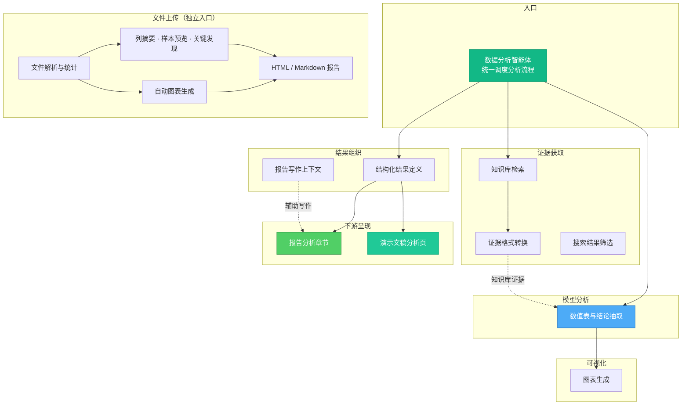
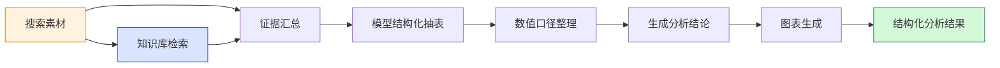
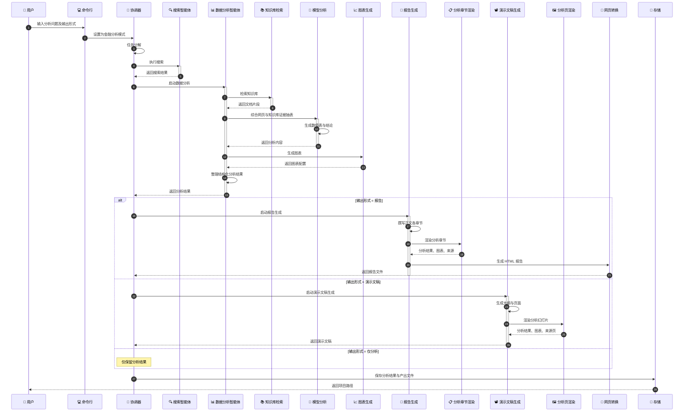
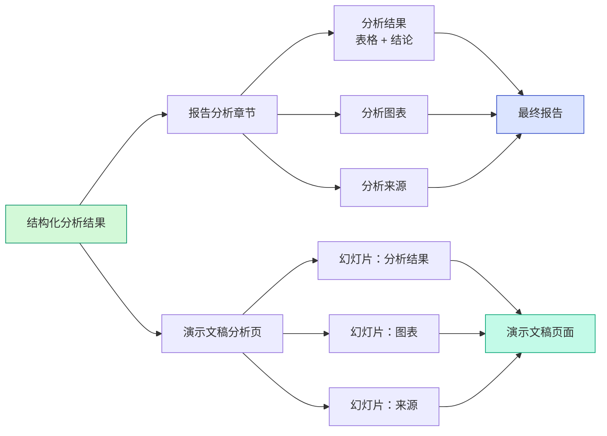
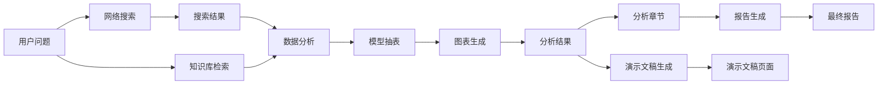
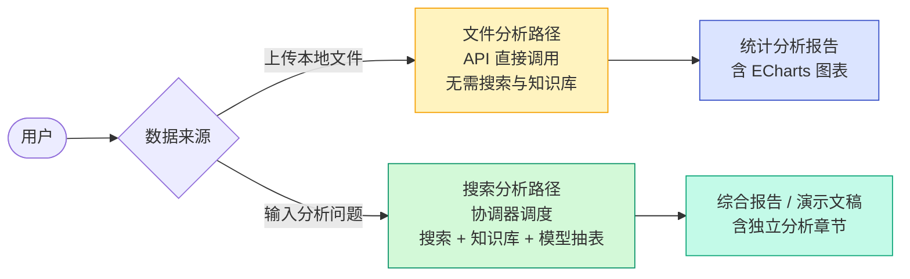
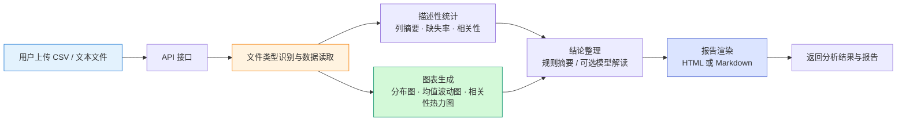
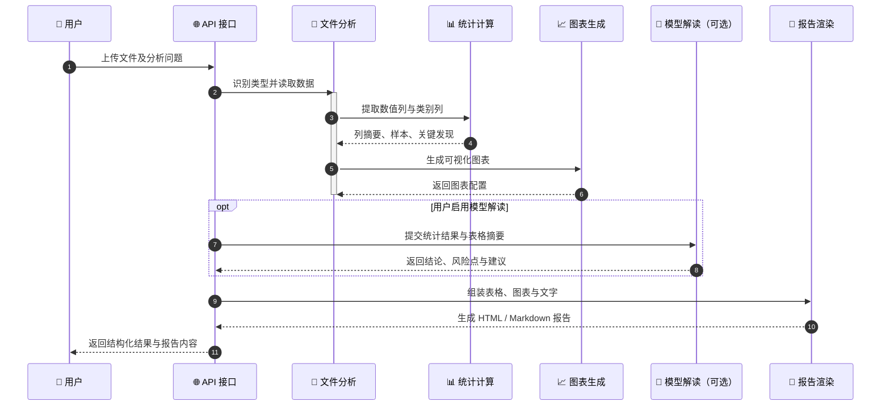
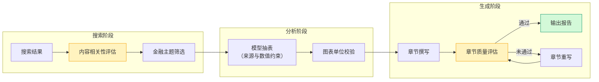

# 五、系统核心模块详细设计与实现

本章在前章总体架构基础上，对系统三个核心模块的设计思路、内部组成与处理流程作详细说明，涵盖搜索、金融数据分析与质量控制，构成开发实现的主体内容。

---

## 5.1 搜索智能体模块

搜索智能体负责将用户的自然语言问题转化为可检索、可分析的结构化素材，是后续金融分析与报告生成的数据起点。该模块由网络搜索、搜索分析与内容评估三部分协同完成。

### 5.1.1 模块组成

| 组件 | 职责 |
|------|------|
| **网络搜索器** | 对接 DuckDuckGo 等搜索引擎，按子任务发起检索，支持时间范围过滤 |
| **搜索分析器** | 对检索到的网页摘要进行主题归纳、相关性打分与要点提取 |
| **内容评估器** | 从主题、时间、质量三个维度评估单条内容与用户问题的匹配程度，筛除无关结果 |

搜索智能体在协调器分解出的各搜索子任务上循环执行：每个子任务独立检索、分析与整合，最终汇总为统一的搜索结果列表，供下游数据分析与内容生成使用。

### 5.1.2 处理流程

搜索模块的处理流程如图 5-1 所示。

**图 5-1 搜索智能体处理流程**

各步骤说明如下：

**（1）查询改写与子任务检索。** 协调器将用户问题分解为若干搜索子任务，每个子任务携带标题、关键词与多条检索语句。搜索器对每个子任务最多并行执行三条检索，并解析问题中的时间信息，作为后续过滤依据。

**（2）网页搜索与正文抽取。** 网络搜索器返回标题、链接与摘要；若摘要不足，则进一步抓取网页正文。每条结果记录来源、正文长度、所属子任务及提取时间等元数据。

**（3）子任务级分析与整合。** 对每个子任务的检索结果，搜索分析器调用大语言模型生成分析摘要、关键洞察与相关性评分；随后将原始结果与分析结论整合为精炼文本，便于报告撰写直接引用。

**（4）去重与排序。** 全部子任务完成后，系统按 URL 去除重复页面，再综合标题匹配度、正文长度、时间吻合度等因素计算相关性得分，按得分降序排列。

**（5）有效信息筛选。** 内容评估器对候选结果逐条评估主题相关性、时间相关性与内容质量，仅保留得分达标的内容。金融分析模式下，还可按问题中的公司主体与财务关键词进一步筛选，减少无关资讯干扰。

### 5.1.3 输出内容

搜索模块最终输出包含以下信息：

- **原始搜索结果列表**：每条含标题、链接、正文、摘要、相关性得分及时间上下文；
- **精炼子任务内容**：按子任务组织的分析摘要与要点；
- **搜索执行摘要**：各子任务的检索数量与执行状态。

上述素材写入协调器全局状态，供金融数据分析智能体抽取数值、供报告生成器撰写正文。

---

## 5.2 金融数据分析智能体模块

金融数据分析智能体是系统的核心业务模块，负责将搜索素材与知识库证据转化为结构化数值表、分析结论与可视化图表。该模块与通用搜索分析分离，专门处理财务指标抽取与呈现；同时提供用户上传文件的独立分析路径。

用户通过分析命令进入金融分析模式：协调器在搜索完成后调用本模块，先检索知识库，再与搜索结果一并提交大语言模型抽表制图，最终按用户选择产出报告、演示文稿或仅分析结果文件。用户也可经 API 上传 CSV 等本地数据，不经协调器直接完成统计分析与报告生成。

### 5.2.1 模块组成

| 组件 | 职责 |
|------|------|
| **数据分析入口** | 接收用户问题、搜索结果及知识库证据，组织完整分析流程 |
| **知识库检索** | 从年报向量库检索与问题相关的文档片段 |
| **模型抽表模块** | 将网页与知识库证据交给大语言模型，抽取有原文依据的数值表 |
| **图表生成模块** | 根据数值表自动选择折线图或柱状图，生成 ECharts 配置 |
| **结果组织模块** | 定义分析结果的数据结构，供报告与演示文稿渲染 |
| **文件分析模块** | 独立处理用户上传的 CSV、TSV 或文本文件 |

### 5.2.2 模块内部结构

模块内部按职责分为证据获取、模型分析、可视化、结果组织、下游呈现及文件上传六部分，如图 5-2 所示。

**图 5-2 金融数据分析模块内部结构**

搜索驱动主流程中，数据分析智能体接收搜索结果后并行访问知识库，将两类证据交给大语言模型抽取表格与结论，再生成图表并组织为结构化结果，最后交由报告或演示文稿模块呈现。文件上传路径经 API 独立执行，不经过搜索与协调器调度，输出格式与主流程保持一致。

### 5.2.3 搜索驱动分析流程

主流程如图 5-3 所示。

**图 5-3 搜索驱动分析主流程**

**（1）证据获取。** 模块同时接收协调器传入的搜索结果，并按用户问题检索知识库，获取年报等文档片段。两类证据经格式转换后统一组织，网页来源与知识库来源分别编号标注。

**（2）模型结构化抽表。** 模型抽表模块将问题与全部证据一并提交大语言模型，按严格规则抽取数值：仅保留正文中有明确依据的数字；保留单位与期间；冲突数据分行列出，不自行合并；每行标注来源与原文摘录。若无可用数值，返回空表并说明原因。

**（3）数值口径整理。** 对抽取结果进行后处理：统一中英文金额单位表述，修正结论与表格之间的数值一致性，避免图表因单位混排而失真。

**（4）图表生成。** 图表生成模块读取数值表，识别指标名称与数值列。若含季度信息则生成折线图，否则生成柱状图；当表中同时存在百分比与绝对值时，优先选取单位一致的行绘图，防止坐标轴被极端数值撑满。

**（5）结果输出。** 最终输出包含主数值表、文字结论、分析口径说明、图表配置、来源列表及关键发现条目。结果写入项目中间文件，并传递给报告或演示文稿模块。

图 5-4 描述从用户输入到结果保存的完整时序。

**图 5-4 搜索驱动分析端到端时序**

### 5.2.4 分析结果结构与呈现

成功完成的分析结果主要包含以下内容：

| 内容 | 说明 |
|------|------|
| 数值表 | 指标名称、数值、期间、来源编号、原文依据 |
| 分析结论 | 基于表格归纳的中文说明，与数值保持一致 |
| 图表 | 与数值表对应的 ECharts 可视化配置 |
| 来源信息 | 参与分析的网页与知识库条目 |
| 分析口径 | 说明本次抽取的范围与方法 |

搜索驱动分析的结果在报告与演示文稿中固定分为三个部分：分析结果（表格与文字结论）、分析图表、分析来源（所引用的网页与知识库条目）。报告以独立章节形式插入；演示文稿在结论页之前插入相应幻灯片。分析章节由代码确定性渲染，不再二次调用模型改写数字。如图 5-5 所示。

**图 5-5 分析结果呈现结构**

### 5.2.5 数据流总览

图 5-6 汇总搜索驱动分析从用户问题到最终产出的主要数据流向。

**图 5-6 搜索驱动分析数据流**

### 5.2.6 两种分析模式对比

系统提供搜索驱动分析与文件上传分析两条路径，对比如图 5-7 所示。

**图 5-7 两种数据分析模式对比**

### 5.2.7 用户上传文件分析

用户经 API 上传 CSV、TSV 或文本文件，由文件分析模块独立完成解析、统计与制图，全程不经过协调器工作流。处理流程如图 5-8 所示。

**图 5-8 用户上传文件分析流程**

| 步骤 | 主要工作 |
|------|----------|
| 文件接收 | API 接收文件名、文件类型及文件内容，可选传入分析问题 |
| 类型识别 | 根据扩展名与内容特征判断 CSV、TSV 或纯文本 |
| 数据读取 | 解析表格，支持多种编码；对含货币符号、百分号的列尝试转为数值 |
| 统计分析 | 统计行列规模、缺失情况；数值列计算均值、中位数、标准差等；检测高相关列组合 |
| 图表生成 | 类别列生成分布图；数值列生成均值与标准差对比图及相关性热力图 |
| 结论整理 | 默认按规则生成要点摘要；可选调用大语言模型补充业务解读 |
| 报告输出 | 将表格、图表与结论组装为 HTML 或 Markdown 页面 |

对于 CSV、TSV 文件，系统输出列摘要、样本预览、分布图、相关性热力图等；对于纯文本文件，统计词频并生成关键词频次图。HTML 报告内嵌 ECharts 图表；来源部分仅标注上传文件名，不包含网页或知识库引用。

图 5-9 描述文件上传分析的时序。

**图 5-9 文件上传分析时序**

---

## 5.5 内容审核智能体与质量控制模块

大语言模型生成的内容可能存在幻觉、引用错误、数据不一致或时间不匹配等问题。质量控制模块贯穿搜索、分析与报告生成全过程，通过多层评估与修正机制提高输出可靠性。

### 5.5.1 模块必要性

金融分析场景对数据准确性要求较高。若不对中间结果与生成内容加以校验，可能出现以下问题：引用与原文不符的虚构数值；报告正文与分析表格数据矛盾；检索到与问题时间范围不符的旧闻；章节内容偏离用户问题。质量控制模块针对上述风险，在关键环节设置检查点，对不合格内容触发过滤或重写。

### 5.5.2 核心功能

**（1）内容相关性评估。** 内容评估器对每条搜索结果从主题匹配、时间匹配、内容质量三个维度打分，仅保留总分达标的条目。评估过程结合问题中解析出的时间信息，降低过期或不相关资讯进入分析环节的概率。

**（2）搜索结果筛选。** 金融分析模式下，系统按问题中的公司主体与财务主题词对搜索结果进行二次筛选，优先保留含明确财务数据的页面，减少新闻类无关内容对抽表的干扰。

**（3）章节质量校验。** 报告生成过程中，章节评估器对每一节撰写结果进行质量打分，检查内容完整性、与要求的吻合度及与可用来源的一致性。得分低于阈值时，触发章节重写，最多迭代若干轮，直至通过或达到上限。

**（4）引用与数值约束。** 模型抽表阶段通过提示规则约束：禁止无依据编造数值、要求标注来源与原文摘录、冲突数据不得自行合并。图表生成阶段检查数值单位一致性，避免混排导致可视化失真。分析章节由代码渲染，报告正文不得覆盖已确定的分析数字。

**（5）时间维度筛选。** 搜索阶段解析问题中的年份、季度等时间信息，作为检索过滤与相关性评分的依据；内容评估器在评分中单独考察内容时间与问题时间的匹配程度。

**（6）不合格内容修正。** 章节评估未通过时，报告协调器根据评估建议调用章节撰写器重写；搜索阶段不相关的结果直接剔除，不进入后续分析；模型抽表返回空表时，系统记录原因并跳过后续图表生成，避免展示无依据内容。

### 5.5.3 质量控制流程

质量控制与各业务模块的衔接关系如图 5-10 所示。

**图 5-10 质量控制流程**

### 5.5.4 各阶段控制要点

| 阶段 | 控制措施 | 处理方式 |
|------|----------|----------|
| 搜索 | 三维相关性评估、时间匹配 | 剔除低分结果 |
| 搜索 | 金融关键词与主体匹配 | 优先保留含财务数据的页面 |
| 分析 | 抽表规则约束、来源标注 | 空表则跳过图表，记录原因 |
| 分析 | 数值单位一致性检查 | 过滤不可比的混排数据 |
| 生成 | 章节质量评分 | 低于阈值则重写，限最大轮次 |
| 呈现 | 分析章节代码渲染 | 数字与图表不再经模型二次修改 |

---

## 本章小结

搜索智能体通过「检索—抽取—分析—去重—筛选」流程，为系统提供高质量的结构化搜索素材。金融数据分析智能体（5.2 节）涵盖模块内部结构、搜索驱动与文件上传两条分析路径、端到端时序、结果呈现及数据流等内容。质量控制模块在搜索、分析与生成各阶段设置评估与约束机制，从相关性、准确性、一致性与时间匹配等方面保障最终报告的可信度。三个模块分工明确、衔接紧密，共同支撑系统从用户提问到分析报告输出的完整链路。
