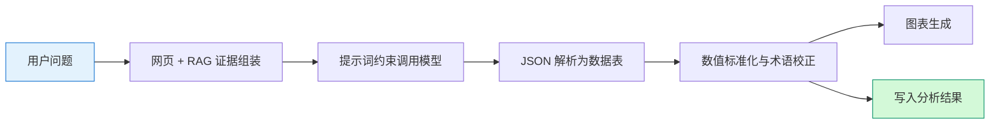
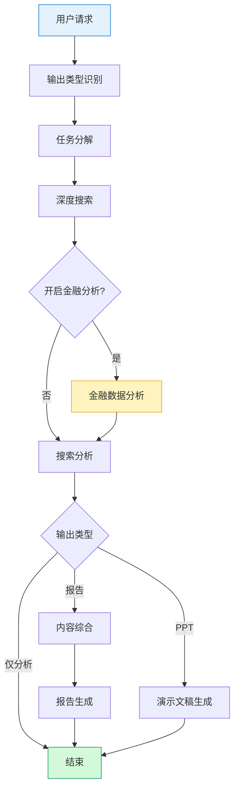

# 六、核心算法与关键函数设计

本章在前章模块设计基础上，提炼系统实现中的核心算法原理与关键函数接口，体现搜索筛选、金融抽表、数值标准化、图表推断与多智能体调度等技术要点，并辅以核心函数表供查阅。

---

## 6.1 核心算法原理

### 6.1.1 搜索结果去重与排序算法

深度搜索模块在汇总各子任务检索结果后，需对海量网页条目进行去重并按相关性重排，以保证下游分析与报告撰写优先使用高质量素材。算法分为去重与打分排序两个阶段。

**（1）URL 去重。** 系统遍历全部检索结果，以页面 URL 为唯一键维护已见集合；仅当 URL 非空且尚未出现时保留该条记录。该策略简单高效，可有效消除同一链接在多条检索语句或多子任务中重复出现的情况。

**（2）多因子相关性打分。** 对去重后的每条结果计算综合得分，各因子加权累加：

| 因子 | 规则 | 加分 |
|------|------|------|
| 标题匹配 | 检索词按空格切分后，统计在标题中出现的词数 | 每词 +2 |
| 用户文档 | 来源标记为「用户上传文档」 | +100 |
| 正文长度 | 正文超过 1000 字 | +2；超过 500 字 | +1 |
| 时间吻合 | 问题中解析出目标日期，且页面提取时间与目标日期在工具判定范围内相关 | +3 |

每条结果将得分写入 `relevance_score` 字段，最终按得分降序排列。该算法不依赖大语言模型，计算开销低，适合在搜索阶段即时完成。

去重与排序的处理流程如图 6-1 所示。

**图 6-1 搜索结果去重与排序流程**

### 6.1.2 金融主题相关性筛选算法

在金融数据分析场景下，协调器输出的搜索结果往往混杂新闻、评论与无关公司资讯。系统实现了面向分析任务的**查询驱动相关性筛选算法**，从问题文本解析实体、主题与年份，再对每条搜索结果进行规则打分与主体校验，优先保留「目标公司为核心主体且含可抽取财务信号」的页面。

**（1）查询词项解析。** 从用户问题中提取三类词项：

- **实体**：匹配「××公司」模式，或经停用词过滤后的连续中文/英文词；支持股票代码与常用别名扩展（如 AAPL → Apple）；
- **主题**：与财务相关的关键词表匹配（营收、净利润、毛利率、risk factors 等）；
- **年份**：正则提取 20xx 格式年份。

**（2）主体核心性判定。** 对每条结果，要求标题或正文中出现目标实体；若标题以其他品牌开头而目标实体仅顺带出现，则视为「顺带提及」并剔除。金融类问题还须正文在实体附近出现营收/利润等财务词，或与问题主题一致的数值模式。

**（3）加权打分。** 在通过主体校验的前提下，按标题/正文中的实体命中、主题词、年份、财务数值信号、正文长度等维度累加得分；用户文档来源额外大幅加分。得分低于阈值（默认 8.0）的条目丢弃，最多保留 8 条；若严格模式下无匹配，可降级放宽主体约束重试。

该算法与搜索阶段的去重排序互补：前者面向通用检索质量，后者面向金融抽表的证据充分性，二者共同降低无关资讯进入模型抽表环节的概率。

### 6.1.3 大语言模型金融结构化抽取算法

搜索驱动分析路径的核心是将非结构化网页与知识库片段转化为可计算的数值表。系统采用**提示约束 + 结构化解析**的两段式抽表算法。

**（1）证据组装。** 从搜索结果与 RAG 检索结果中各取最多 10 条，每条正文截断至约 2500 字；网页证据编号为 W1、W2…，知识库证据编号为 R1、R2…，与用户问题一并序列化为 JSON 输入。

**（2）提示规则约束。** 系统提示词规定八项硬性规则：禁止编造数值；仅抽取与问题直接相关的指标；人民币金额须统一单位；保留期间列；来源列标注 W/R 前缀；冲突数据分行列出不合并；英文金额须正确换算（如 $6.95B → 69.5 亿美元）；无数据时返回空表并说明原因。

**（3）响应解析。** 模型返回 JSON 对象，包含 `table`（标题、列名、行数据）、`conclusion` 与 `methodology`。解析器支持从 Markdown 代码块中提取 JSON，并构造标准数据表对象。解析失败则记录日志并终止抽表，避免脏数据进入制图环节。

**（4）后处理链。** 抽表成功后依次执行：人民币单位标准化（见 6.1.4）、毛利率/净利率等术语校正、美元金额与结论文本的一致性替换，最后调用图表生成模块。

抽表算法的数据流如图 6-2 所示。

**图 6-2 LLM 金融结构化抽表流程**

### 6.1.4 财务数值标准化算法

模型抽表或网页原文中，同一表格常混用「元」「万元」「亿元」等人民币单位，或出现美元 B/billion 与人民币混排。若直接制图，柱状图会因量级差异而失真。系统实现了**自适应人民币单位统一算法**与**美元金额校正规则**。

**（1）人民币自适应单位。** 算法遍历数值列各单元格，用正则解析金额与单位后缀，统一换算为绝对「元」；跳过百分比与美元类文本。取全表最大绝对金额，按量级选择展示单位：

| 最大金额（元） | 展示单位 |
|--------------|----------|
| ≥ 1 亿 | 亿元 |
| ≥ 1 万 | 万元 |
| 其余 | 元 |

各金额单元格按选定单位重格式化（整数去小数尾），列名补充单位标注（如「数值（亿元）」）。百分比行不参与换算，保持原样。

**（2）美元金额校正。** 对匹配 `$数字B/billion` 模式的单元格，按「1 美元 ≈ 10 亿元人民币」的展示口径生成「$XB（约 Y 亿美元）」格式，并同步替换分析结论中的错误表述，避免将 $6.95B 误写为 6.95 亿美元。

**（3）利润率术语区分。** 根据原文中的 gross margin、profit margin、operating margin 等信号，自动将指标列中的「毛利率」校正为「净利率」「营业利润率」等，防止英文财报指标中文译名混淆。

### 6.1.5 图表智能类型推断算法

数据分析模块根据数值表内容自动选择折线图或柱状图，并在行选取阶段处理单位混排问题。算法逻辑如下。

**（1）行选取与单位一致性检查。** 最多取前 12 行；识别每格数值的类型为「百分比」「金额」或「纯数字」。若同时存在百分比与绝对金额，优先保留百分比行；若存在多种金额单位（亿/万/美元等），则放弃制图，避免不可比数据同图展示。

**（2）图表类型推断。**

- 若列名含「季度」或类别轴含 Q1/Q2 等季度标记，且存在非零数值 → **折线图**（平滑曲线，适合时间序列）；
- 否则 → **柱状图**，纵轴名称由单元格文本推断（百分比、万元、亿美元等）。

**（3）数值解析。** 柱状/折线图数据将单元格文本解析为浮点数：百分比保留原值；「亿元」按亿为单位；「万元」换算为亿分之一；美元 B 类按约定倍数换算。解析结果传入 ECharts 配置生成器产出完整图表规格。

**（4）文件上传路径的图表策略。** 对用户上传 CSV，系统另有一套规则：类别列唯一值在 2～10 个时生成饼图；数值列生成双轴图（均值柱 + 标准差线）；多列数值时生成相关性热力图。与搜索抽表路径共用 ECharts 生成器，但推断规则针对表格统计场景定制。

### 6.1.6 多智能体任务调度算法

系统以 LangGraph 状态机实现多智能体编排：全局状态 `DeepSearchState` 携带问题、输出类型、子任务、搜索结果、分析结果与错误列表等字段；各节点读写状态并沿条件边流转。

**（1）入口路由。** 输出类型检测节点根据用户选择或上下文，将任务分为研究报告、演示文稿、小说创作或金融分析等类型，映射到不同首节点。

**（2）主链路（报告 / 演示文稿 / 金融分析）。** 任务分解 → 深度搜索 → 搜索分析 → 内容综合 → 报告生成（或演示文稿生成）。深度搜索节点内按子任务循环：检索、子任务分析、子任务整合，再全局去重排序。

**（3）金融分析插入点。** 当输出类型为金融分析，或研究报告/演示文稿上下文开启分析模块时，系统在**深度搜索完成后**同步调用数据分析节点：将 `search_results` 与 RAG 检索结果交给数据分析智能体，结果写入 `data_analysis_results`，再进入搜索分析或按交付物类型跳转。

**（4）条件分支。** 搜索分析完成后：金融分析模式且交付物为 PPT → 演示文稿生成；交付物为 none → 直接结束；其余 → 内容综合后生成报告。小说类任务走独立分支（要素设计 → 大纲 → 写作）。

**（5）容错与限流。** 单节点异常写入 `errors` 列表但不中断全流程；搜索结果超过配置上限时截断；章节质量评估未通过时触发重写并限制最大轮次。

调度关系如图 6-3 所示（研究报告路径，含可选金融分析）。

**图 6-3 多智能体任务调度（研究报告 + 可选金融分析）**

### 6.1.7 内容质量评估与章节重写算法

质量控制环节采用**模型评分 + 阈值判定 + 迭代重写**策略，覆盖搜索素材与报告章节两类对象。

**（1）搜索结果相关性评估。** 内容评估器对每条候选结果并行调用大语言模型，从主题相关性、时间相关性、内容质量三个维度各打 0～10 分，总分 ≥ 15 视为相关并保留。评估提示词注入问题解析出的时间上下文，降低过期资讯通过率。

**（2）章节质量评估。** 章节评估器对每节撰写结果构建评估提示，模型返回各维度得分与问题列表；系统计算综合置信度，低于阈值（默认 0.7）则标记未通过。报告协调器根据建议调用章节撰写器重写，直至通过或达到最大迭代次数。

上述算法与 6.1.2 的规则筛选、6.1.3 的抽表约束形成「搜索—分析—生成」全链路质量闭环。

---

## 6.2 关键核心函数说明

本节按模块整理核心函数的职能、主要入参、出参与典型调用关系，便于对照实现与测试。

### 6.2.1 搜索与筛选

| 函数 / 方法 | 所属模块 | 功能说明 | 主要入参 | 返回值 | 调用时机 |
|-------------|----------|----------|----------|--------|----------|
| `execute_deep_search` | 深度搜索器 | 按子任务执行检索、分析、整合，再全局去重排序 | 用户问题、任务分解结果、时间上下文 | 全部内容列表、精炼子任务、搜索摘要 | 协调器深度搜索节点 |
| `_deduplicate_content` | 深度搜索器 | 按 URL 去重 | 内容列表 | 去重后列表 | `execute_deep_search` 汇总后 |
| `_rank_content_by_relevance` | 深度搜索器 | 多因子打分并降序排列 | 内容列表、检索词、时间上下文 | 带 `relevance_score` 的排序列表 | 去重之后 |
| `parse_query_terms` | 搜索相关性 | 从问题解析实体、主题、年份 | 用户问题字符串 | `QueryTerms` 对象 | 金融筛选前 |
| `score_search_result` | 搜索相关性 | 单条搜索结果规则打分 | 结果条目、查询词项 | 浮点得分 | 筛选循环内 |
| `select_relevant_search_results` | 搜索相关性 | 主体校验 + 打分 + 阈值截断 | 问题、搜索结果列表、上限与阈值 | 筛选结果列表与元信息 | 金融分析证据准备（可选） |
| `evaluate_content_relevance` | 内容评估器 | 并行评估多条内容相关性 | 问题、内容列表、时间上下文 | 相关条目列表 | 搜索后质量过滤 |

### 6.2.2 金融分析与抽表

| 函数 / 方法 | 所属模块 | 功能说明 | 主要入参 | 返回值 | 调用时机 |
|-------------|----------|----------|----------|--------|----------|
| `process` | 数据分析智能体 | 分析流程总入口：解析搜索结果、检索 RAG、抽表制图 | 问题、搜索结果、是否 mock | 标准成功/空结果/错误信封 | 协调器数据分析节点或 API |
| `extract_table_from_search` | LLM 搜索分析器 | 组装证据并调用模型抽表 | 问题、搜索结果、RAG 证据、LLM 回调 | `LLMSearchAnalysis` 或 None | 数据分析智能体内部 |
| `normalize_table_monetary_units` | LLM 搜索分析器 | 人民币金额自适应单位统一 | `DataTable` | 标准化后的数据表 | 模型 JSON 解析后 |
| `_normalize_table_and_conclusion` | 数据分析智能体 | 利润率术语与美元金额校正 | 数据表、结论文本 | 校正后结论 | 抽表成功后的后处理 |
| `build_chart_for_table` | 图表生成器 | 推断图表类型并生成 ECharts 配置 | 数据表、图表 ID | 图表规格字典或 None | 抽表成功且行非空时 |
| `retrieve_pack` | RAG 客户端 | 向量检索年报等金融文档片段 | 问题、top_k | `RAGEvidencePack` | 数据分析前 |
| `build_analysis_input` | 证据适配器 | 统一网页与 RAG 为分析输入 | 问题、搜索结果、RAG 包 | `AnalysisInput` | 多源证据融合场景 |
| `analyze_file` | 文件分析器 | CSV/文本上传解析与统计制图 | 问题、文件名、内容、类型 | `DataAnalysisResult` 字典 | API 金融分析（文件上传） |

### 6.2.3 报告生成与质量控制

| 函数 / 方法 | 所属模块 | 功能说明 | 主要入参 | 返回值 | 调用时机 |
|-------------|----------|----------|----------|--------|----------|
| `evaluate_section` | 章节评估器 | 对单节内容质量打分 | 章节结果、撰写要求、可用来源 | 通过与否、置信度、建议 | 报告协调器每节撰写后 |
| `format_analysis_for_writer` | 分析上下文 | 将分析结果压缩为章节撰写可用摘要 | 分析结果字典 | JSON 格式摘要文本 | 报告章节撰写前 |
| `mark_data_integration_sections` | 分析上下文 | 标记应引用分析数据的正文章节 | 大纲章节列表、分析结果 | 带整合标记的章节列表 | 大纲生成后 |
| `has_usable_analysis` | 分析上下文 | 判断是否存在可用表格或发现 | 分析结果字典 | 布尔值 | 决定是否插入分析模块 |

### 6.2.4 协调与调度

| 函数 / 方法 | 所属模块 | 功能说明 | 主要入参 | 返回值 | 调用时机 |
|-------------|----------|----------|----------|--------|----------|
| `_create_langgraph_workflow` | 协调器 | 构建 LangGraph 状态机与工作流图 | 无 | 编译后的工作流 | 协调器初始化 |
| `process_query` | 协调器 | 接收用户问题，创建项目并执行工作流 | 问题、上下文字典 | 最终状态与产出 | CLI / API 入口 |
| `_deep_searcher_node` | 协调器 | 执行深度搜索，可选触发数据分析 | `DeepSearchState` | 更新后的状态 | 工作流节点 |
| `_data_analyzer_node` | 协调器 | 调用数据分析智能体并写回状态 | `DeepSearchState` | 更新后的状态 | 金融分析模式搜索完成后 |
| `_route_after_search_analyzer` | 协调器 | 搜索分析后路由至报告/PPT/结束 | `DeepSearchState` | 下一节点名称 | 条件边函数 |
| `_is_financial_analysis_mode` | 协调器 | 判断是否启用金融分析路径 | `DeepSearchState` | 布尔值 | 多处路由与节点内判断 |

### 6.2.5 典型调用链说明

为便于理解函数间的协作关系，列举两条主路径的核心调用顺序：

**路径 A：研究报告 + 金融分析模块**

`process_query` → `_task_decomposer_node` → `_deep_searcher_node`（`execute_deep_search`）→ `_data_analyzer_node`（`process` → `extract_table_from_search` → `normalize_table_monetary_units` → `build_chart_for_table`）→ `_search_analyzer_node` → `_content_synthesizer_node` → `_report_generator_node`（`format_analysis_for_writer`、`evaluate_section` 等）。

**路径 B：金融分析（CSV 上传）**

API 接收文件 → `FileDataAnalyzer.analyze_file`（`_analyze_csv` → `_build_csv_charts`）→ 报告渲染模块组装 HTML/Markdown，不经过协调器工作流。

---

## 本章小结

本章从算法层面归纳了系统的六项核心技术：搜索结果去重排序、金融主题相关性筛选、大语言模型结构化抽表、财务数值自适应标准化、图表类型智能推断以及基于 LangGraph 的多智能体调度；并补充了内容质量评估与章节重写机制。6.2 节以表格形式整理了搜索、分析、质量控制与调度模块的关键函数及其调用关系。上述算法与函数与第五章模块设计一一对应，共同构成系统从原始资讯到结构化分析报告的技术内核。
