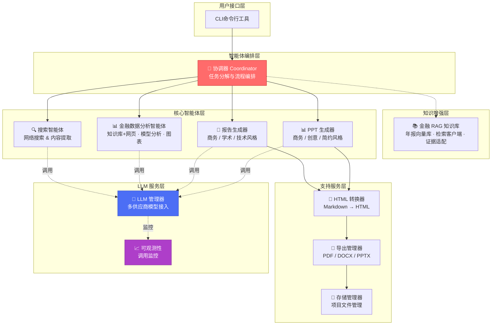
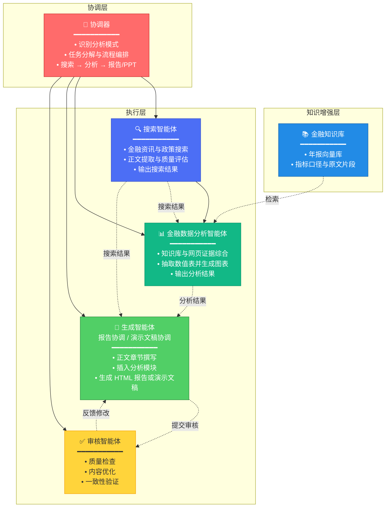
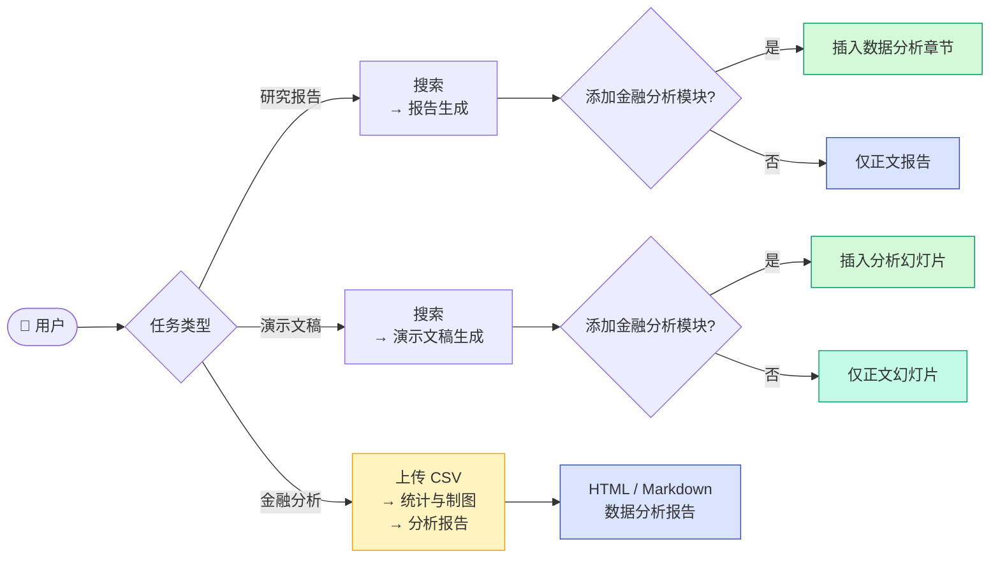

# 四、系统总体架构设计

本章说明系统的总体架构，包括设计思路、分层结构与多智能体协作流程，并配合架构图进行说明。

---

## 4.1 架构设计思路

本系统面向金融资讯检索、数据分析与多形态内容生成，采用多智能体协同与分层模块化设计，将复杂任务拆分为若干子任务，由不同功能模块分别完成，再由统一调度模块组织执行顺序与数据传递。

### 4.1.1 核心设计原则

**统一调度。** 用户请求由协调器统一接收。协调器负责识别任务类型、分解子任务、选择执行路径，避免各功能模块独立决策导致流程不一致。

**流程可控。** 系统以状态机描述工作流，各处理阶段按固定顺序或条件分支执行，支持报告生成、演示文稿生成、金融数据分析等多种模式。

**多源证据融合。** 分析任务同时使用两类信息来源：一是网络搜索获得的实时资讯，二是向量检索获得的年报等金融文档片段。两类来源相互补充，提高分析依据的覆盖面。

**模型调用集中管理。** 各智能体通过统一的大语言模型服务接口发起调用，可按任务类型配置不同模型与参数，便于更换供应商和维护。

**分析与呈现分离。** 金融数据分析结果以结构化形式保存，报告正文与数据分析章节分别生成后再合并，保证图表与文字内容互不干扰。

**结果可追踪、可导出。** 系统记录模型调用过程，支持监控与排查；最终产物可导出为网页、文档、演示文稿等多种格式，并按项目归档存储。

### 4.1.2 任务类型与编排路径

前端工作台提供三类任务入口，与后端编排逻辑对应如下。

| 任务类型 | 用户操作 | 编排路径 | 典型产出 |
|----------|----------|----------|----------|
| 研究报告 | 输入研究主题，配置检索深度与报告格式；可选开启金融分析模块 | 协调器调度：搜索 →（可选）金融分析 → 报告生成 | HTML / Markdown 研究报告；开启分析模块时含独立「金融数据分析」章节 |
| 演示文稿 | 输入演讲主题与风格偏好；可选开启金融分析模块 | 协调器调度：搜索 →（可选）金融分析 → 演示文稿生成 | 多页 HTML 演示文稿，可导出 PPTX；开启分析模块时含分析幻灯片 |
| 金融分析 | 上传 CSV 等金融数据文件，填写分析问题（可选） | API 直接调用：文件解析 → 统计与制图 → 报告渲染 | HTML / Markdown 数据分析报告，含表格与 ECharts 图表 |

**研究报告与演示文稿。** 两类任务以网络检索与内容生成为主路径。用户可在表单中勾选「添加金融分析模块」：开启后，系统在搜索完成后插入数据分析步骤，从检索结果与知识库证据中抽取数值表并生成图表，再以独立章节或幻灯片嵌入最终产出；未开启时，仅生成基于搜索素材的正文内容，不包含结构化分析模块。

**金融分析。** 该入口面向用户已有的本地数据，不经过协调器与搜索流程。用户上传 CSV、TSV 或文本文件后，系统完成类型识别、描述性统计、相关性分析与图表生成，并输出可浏览的分析报告；可选调用大语言模型对统计结果进行文字解读。

三类任务均通过网页工作台提交，由任务监控面板展示执行状态与结果下载入口。

---

## 4.2 整体分层架构（配图说明）

系统自上而下划分为七层。图 4-1 给出主要组件及其调用关系，4.2.1 节说明组件图读法，4.2.2 节逐层介绍各层职责。

### 4.2.1 架构组件总览

**图 4-1 系统架构组件图**

图中实线表示任务编排与数据主路径；虚线表示知识库访问与各智能体对大语言模型的调用。协调器负责流程组织，不直接调用大模型；知识库检索在金融分析模式下由数据分析智能体内部执行。核心智能体层包括搜索、数据分析、报告生成与演示文稿生成四类模块；支持服务层负责格式转换、导出与存储；最底层为大语言模型服务与可观测性监控。

### 4.2.2 各层功能说明

#### 4.2.2.1 用户交互层

本层面向最终用户，提供命令行工具与网页工作台两种入口。用户以自然语言输入问题或分析需求，系统返回检索结果、数据图表、分析报告或演示文稿；用户也可在网页端上传 CSV 等金融数据文件，直接获取统计分析报告与可视化图表。命令行适合脚本化与本地调试；网页端支持任务提交、文件上传、进度查看与结果预览。

#### 4.2.2.2 API 服务层

本层对外提供 REST 接口，负责接收前端或第三方系统的请求，创建异步任务，并返回任务状态与结果下载地址。接口覆盖报告生成、演示文稿生成、金融数据分析等场景。其中，文件上传分析接口单独处理：接收用户提交的 CSV、TSV 或文本内容及可选的分析问题，直接调用文件分析模块，同步返回结构化结果与 HTML/Markdown 报告。需要协调器参与的报告、演示文稿等任务，仍与命令行共用同一套编排逻辑。

#### 4.2.2.3 智能体编排层

本层是系统的调度核心。协调器根据用户输入识别输出类型，将问题分解为若干可执行的搜索子任务，并按模式选择后续路径。编排层采用基于 LangGraph 的工作流引擎，维护全局执行状态，依次驱动搜索、分析、内容生成等阶段，并在金融分析模式下插入专门的数据分析步骤。任务类型可由用户显式指定，也可由系统在入口处自动判断。

#### 4.2.2.4 工具与检索层

本层提供搜索、提取、评估、制图等基础能力，供上层智能体调用。主要包括：网络搜索引擎接入与网页正文提取；按时间范围过滤检索内容；评估搜索结果与用户问题的相关程度；将分析得到的数值表转换为图表配置。针对用户上传的文件，本层还包含表格解析、数值列识别与清洗、描述性统计、相关性计算及图表推荐等功能。该层不直接面向用户，由智能体或 API 接口调用。

#### 4.2.2.5 RAG 数据层

本层负责金融领域知识的离线构建与在线检索。离线阶段对年报等 PDF 文档进行解析、分块与向量化，写入 Chroma 向量数据库；在线阶段根据用户问题检索相关片段，返回原文摘录及出处信息。系统支持本地向量库、测试用模拟数据及远程接口等多种接入方式，可按部署环境配置。未启用知识库时，系统仍可仅依赖网络搜索完成分析。

#### 4.2.2.6 内容生成与质控层

本层负责将检索与分析结果转化为可读文本与版式化输出。报告生成包括大纲拟定、分节撰写、章节质量评估与修改；演示文稿生成包括页面规划、内容与版式渲染。系统使用预设提示模板指导大语言模型写作，并对搜索结果相关性、章节完整性与数据格式进行校验。金融数据分析结果单独渲染为「分析结果」「分析图表」「分析来源」三个部分，再嵌入报告或幻灯片。

#### 4.2.2.7 前端可视化层

本层负责分析图表与最终产物的展示。图表采用 ECharts 嵌入 HTML 报告与演示文稿页面；网页工作台提供报告预览、任务历史与状态监控；存储模块按项目目录保存中间结果与最终文件；导出模块支持 PDF、Word、PPT 等格式。用户可在浏览器中直接查看 HTML 报告，或通过 API 下载其他格式。

---

## 4.3 多智能体整体协作流程

### 4.3.1 通用协作流水线

系统将用户请求的处理过程划分为八个阶段，如图 4-2 所示。

**图 4-2 多智能体协作流程**

各阶段含义如下：

| 阶段 | 主要工作 |
|------|----------|
| 需求分析 | 判断用户需要的输出类型（报告、演示文稿、金融分析等） |
| 任务分解 | 将问题拆分为若干搜索子任务，补充时间等上下文 |
| 并行搜索 | 按子任务检索网络并提取网页正文 |
| 内容整合 | 汇总搜索结果；开启金融分析模块时额外完成知识库检索与数值抽取 |
| 智能生成 | 撰写报告正文或生成演示文稿页面 |
| 质量审核 | 检查内容相关性、章节完整性与数据格式 |
| 格式转换 | 将 Markdown 等内容转为 HTML，嵌入图表 |
| 导出输出 | 写入项目目录，提供下载与预览 |

### 4.3.2 嵌入金融分析模块时的协作关系

研究报告或演示文稿任务开启金融分析模块后，协调器在搜索完成后调用数据分析智能体，再进入报告或演示文稿生成。各智能体分工如图 4-3 所示。独立的金融分析任务（上传 CSV）不经过本节所述协作流程，由 API 直接处理文件。

**图 4-3 金融分析模式智能体协作**

执行顺序为：搜索 →（可选）数据分析 → 内容生成。用户可通过参数选择最终产出形式，如图 4-4 所示。

**图 4-4 任务类型与编排路径**

---

## 4.4 本章小结

本章从设计思路、分层结构与协作流程三方面说明系统总体架构。

系统采用多智能体协同与分层模块化设计：协调器统一调度任务，状态机控制流程分支；分析任务融合网络搜索与知识库检索，各智能体经统一模型接口调用大语言模型，分析结果与报告正文分离生成。

架构自上而下分为用户交互、API 服务、智能体编排、工具与检索、RAG 数据、内容生成与质控、前端可视化七层，职责清晰、接口明确。用户请求经需求分析、任务分解、搜索、整合、生成、审核、转换与导出八个阶段完成处理；研究报告与演示文稿可选择是否嵌入金融分析模块；独立的金融分析任务则对用户上传的 CSV 文件直接完成统计与制图。

综上，本架构以协调器为核心、分层解耦为基础、多智能体分工为手段，支撑从用户提问到报告输出的完整链路。
