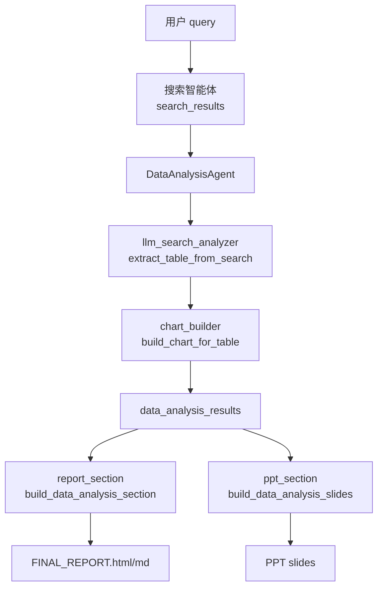

# 金融数据分析智能体

> 本文介绍 SmartFin 项目中**金融数据分析智能体**的功能定位、工作流，以及 `src/agents/data_analysis/` 目录下各文件的作用。

---

## 1. 功能概述

金融数据分析智能体（`DataAnalysisAgent`）是 SmartFin 多智能体系统中负责**结构化金融分析**的专用模块。它与通用搜索分析（`search_analyzer`）分离，专注于：

- 从**网页搜索结果**正文中抽取与用户 query 相关的**数值指标**
- 整理为可追溯的**结构化数据表**（含来源 `[N]` 与原文依据）
- 自动生成 **ECharts 图表**
- 输出写入 `state["data_analysis_results"]`，供报告、PPT 或 API 消费

**设计原则：**

| 原则 | 说明 |
|------|------|
| LLM 抽表 | 数值由 LLM 从搜索正文抽取，禁止无依据编造 |
| 来源可追溯 | 表格「来源」列标注 `[N]`，「原文依据」列摘录原文片段 |
| 与正文分离 | 分析模块独立成章/成页，不与 LLM 撰写的综述正文混写 |
| 确定性渲染 | 报告章节与 PPT 幻灯片由代码渲染，不再二次调用 LLM 改写数字 |

**CLI 入口：**

```bash
python SmartFin.py analyze "分析2024年华为公司营收趋势"
python SmartFin.py analyze "..." --deliverable ppt    # 生成 PPT（含分析模块）
python SmartFin.py analyze "..." --deliverable none   # 仅分析，不生成报告/PPT
python SmartFin.py analyze "..." --mock-search        # 离线联调
```

详细命令说明见 [`金融分析命令_lly.md`](./金融分析命令_lly.md)。

---

## 2. 在工作流中的位置

```
用户 query
    ↓
协调器（coordinator.py）识别 financial_analysis 模式
    ↓
搜索智能体 → search_results[]
    ↓
DataAnalysisAgent.process()
    ├─ llm_search_analyzer   从正文抽数值表 + 结论
    ├─ chart_builder         生成 ECharts spec
    └─ 组装 DataAnalysisResult → data_analysis_results
    ↓
（可选）ReportCoordinator    → FINAL_REPORT 独立章节「金融数据分析」
（可选）PPTCoordinator      → 结论页前插入分析幻灯片
```

协调器在搜索完成后调用 `_data_analyzer_node`，将结果写入：

- `state["data_analysis_results"]` — 结构化分析 payload
- `state["data_analysis_status"]` — 智能体执行状态

持久化路径：`storage/{project_id}/intermediate/03_data_analysis.json`

---

## 3. 分析模块输出结构

成功时，`data_analysis_results` 的核心字段如下：

| 字段 | 说明 |
|------|------|
| `status` | `success` / `skipped` / `error` |
| `analysis_table` | LLM 抽取的主数值表（columns + rows） |
| `analysis_conclusion` | 基于数值表的中文结论 |
| `charts` | ECharts 图表 spec 列表 |
| `search_refs` | 参与分析的网页来源（title / url / snippet） |
| `methodology` | 分析口径说明 |
| `source_blocks` | 兼容旧格式的分块结构（table + chart + conclusion） |
| `key_findings` | 结构化结论条目 |

**报告中的呈现（`report_section.py`）：**

- **分析结果** — 数据表 + 结论
- **分析图表** — ECharts 可视化
- **分析来源** — 仅列出表格「来源」列中出现的 `[N]` 引用，不含摘要

**PPT 中的呈现（`ppt_section.py`）：**

在结论页之前插入 2–3 页：分析结果 / 图表 / 分析来源。

---

## 4. 目录与文件组织

### 4.1 模块目录树

```
src/agents/data_analysis/
├── __init__.py                 # 模块对外导出
├── data_analysis_agent.py      # 智能体入口（编排 LLM 抽表 → 图表 → 输出）
├── llm_search_analyzer.py      # LLM 从搜索结果抽取数值表
├── chart_builder.py            # 由数据表生成 ECharts 图表
├── schemas.py                  # 数据结构契约（Pydantic 模型）
├── data_analysis_context.py    # 报告写作上下文与章节标记
├── report_section.py           # 渲染 HTML/MD 报告中的「金融数据分析」章节
├── ppt_section.py              # 渲染 PPT 中的分析幻灯片
├── file_analyzer.py            # 用户上传 CSV/文本的文件分析（独立路径）
└── file_report.py              # 文件分析结果的 HTML/MD 渲染
```

### 4.2 关联文件（模块外）

| 路径 | 作用 |
|------|------|
| `src/agents/coordinator.py` | 注册 `DataAnalysisAgent`，搜索后触发 `_data_analyzer_node` |
| `src/agents/report/report_coordinator.py` | 组装 FINAL_REPORT，插入金融数据分析章节 |
| `src/agents/ppt/ppt_coordinator.py` | 生成 PPT 时调用 `ppt_section` 注入分析页 |
| `src/agents/html/document_html_agent.py` | HTML 报告渲染，挂载 ECharts 图表 |
| `SmartFin.py` | `analyze` 子命令 CLI 入口 |
| `src/api.py` | `/api/v1/data_analysis/charts` 与 `/api/v1/data_analysis/file` 接口 |
| `fixtures/mock_search.json` | `--mock-search` 离线测试用的模拟搜索结果 |

---

## 5. `data_analysis/` 各文件说明

### `__init__.py`

模块公共导出接口，对外暴露：

- `DataAnalysisAgent` — 智能体主类
- `DataAnalysisResult` / `SearchReference` — 输出契约
- `FileDataAnalyzer` — 文件分析器

其他内部模块（如 `report_section`、`ppt_section`）由报告/PPT 协调器按需 import。

---

### `data_analysis_agent.py`

**智能体入口与编排层。**

- 继承 `BaseAgent`，注册为协调器中的 `data_analyzer` 节点
- `process()` 接收 `query`、`search_results`、`use_mock`
- 主流程：`_process_llm_search()` → 调用 `extract_table_from_search` → `build_chart_for_table` → 组装 `DataAnalysisResult`
- 无搜索结果时返回 `status: skipped`；LLM 未能抽表时返回空表 + 说明信息
- `--mock-search` 且无搜索结果时，从 `fixtures/mock_search.json` 加载数据

---

### `llm_search_analyzer.py`

**LLM 数值抽取核心。**

- `extract_table_from_search(query, search_results, llm_callback)` — 将最多 10 条搜索正文格式化后交给 LLM
- 内置系统提示词，约束：禁止编造、保留单位与期间、来源标注 `[N]`、冲突数值分行列出
- 返回 `LLMSearchAnalysis`（含 `DataTable`、`conclusion`、`methodology`、`search_refs`）
- `_build_search_refs()` — 将原始搜索结果转为 `SearchReference` 列表

这是当前**唯一**的网页金融分析路径，不再使用正则算法抽取。

---

### `chart_builder.py`

**图表生成。**

- `build_chart_for_table(table, chart_id)` — 根据数据表结构选择图表类型：
  - 含「季度」或 `Q` 标签 → 折线图
  - 默认 → 柱状图（第一列类别 + 第二列数值）
- `_parse_metric_value()` — 解析 `8621亿元`、`23%` 等带单位单元格为浮点数
- 依赖 `EChartsGenerator` 输出标准 ECharts option spec

---

### `schemas.py`

**数据结构契约（Pydantic）。**

| 模型 | 用途 |
|------|------|
| `DataFinding` | 单条分析结论（title / value / evidence） |
| `DataTable` | 结构化表格（title / columns / rows） |
| `DataChart` | 图表类型与 spec |
| `SearchReference` | 网页来源引用 |
| `RAGReference` | RAG 引用（字段保留，当前主流程未使用） |
| `DataAnalysisResult` | **最终输出**，写入 `data_analysis_results` |
| `EvidenceItem` / `RAGEvidencePack` 等 | 证据包相关模型（供 API 扩展使用） |

与 `search_analyzer` 产出的 `analysis_results` 字段命名刻意分离，避免混淆。

---

### `data_analysis_context.py`

**报告写作辅助上下文。**

- `has_usable_analysis(data)` — 判断是否有可插入报告/PPT 的有效分析（`analysis_table` 有行，或存在 `source_blocks` 等）
- `format_analysis_for_writer(data)` — 压缩为 SectionWriter 可用的 JSON 摘要（数值不可改写）
- `format_outline_hint(data)` — 大纲生成时的分析摘要提示
- `mark_data_integration_sections(sections, data)` — 标记正文中应引用分析数据的章节（最多 2 章）

供 `ReportCoordinator` 在撰写正文时引用结构化结论，并指向独立「金融数据分析」模块。

---

### `report_section.py`

**HTML/Markdown 报告章节渲染。**

- `build_data_analysis_section(data, section_index)` — 将 `data_analysis_results` 转为可插入 `FINAL_REPORT` 的章节 dict
- 章节结构：**分析结果**（表 + 结论）→ **分析图表** → **分析来源**
- `_cited_search_refs()` — **仅**返回表格「来源」列中出现过的 `[N]` 对应来源，不含摘要
- `_normalize_charts()` — 统一图表 id（`chart_{section_index}_{j}`）与 option 格式
- 输出含 `content`（Markdown）、`content_html`、`charts`、`sources_used`

由 `ReportCoordinator._assemble_report()` 在参考文献之前插入。

---

### `ppt_section.py`

**PPT 分析幻灯片渲染。**

- `build_data_analysis_slides(data, section_index, colors)` — 生成 2–3 页 `html_content` 幻灯片数据
- 复用 `report_section` 的表格渲染与来源过滤逻辑
- 幻灯片类型：分析结果 / 图表（内嵌 ECharts init 脚本）/ 分析来源
- 由 `PPTCoordinator._inject_data_analysis_slides()` 在结论页前插入并重新编号

渲染为确定性 HTML，不经过 LLM，保证与报告数字一致。

---

### `file_analyzer.py`

**用户上传文件分析（独立路径，非 `analyze` 主流程）。**

- `FileDataAnalyzer.analyze_file()` — 分析用户上传的 CSV 或纯文本
- CSV：pandas 读取，生成描述统计、相关性矩阵、趋势图
- 文本：词频统计、关键词提取
- 输出同样符合 `DataAnalysisResult` 形状，供 `/api/v1/data_analysis/file` 使用

与网页搜索分析并行存在，服务于「上传文件 → 自动分析报告」场景。

---

### `file_report.py`

**文件分析结果的报告渲染。**

- `build_file_analysis_markdown(section)` — 生成 Markdown 报告片段
- `build_file_analysis_html(section)` — 生成带 ECharts 的独立 HTML 页面

配合 `FileDataAnalyzer` 与 API 文件分析接口使用。

---

## 6. 数据流示意



---

## 7. 与通用搜索分析的区别

| | `analysis_results` | `data_analysis_results` |
|--|-------------------|--------------------------|
| 来源智能体 | `search_analyzer` | `DataAnalysisAgent` |
| 分析深度 | 轻量主题归纳、洞察列表 | 结构化数值表 + 图表 + 可追溯来源 |
| 输出形态 | `key_insights`、`content_themes` | `analysis_table`、`charts`、`analysis_conclusion` |
| 报告中的位置 | 融入正文各节 | 独立章节「金融数据分析」 |

---

## 8. 快速验证

**单元测试（不依赖真实 LLM / 搜索）：**

```bash
python -m pytest tests/unit/test_data_analysis.py -q
```

**CLI 离线联调：**

```bash
python SmartFin.py analyze "分析2024年银行业营收趋势" --mock-search -v
```

**查看分析 JSON：**

```bash
python SmartFin.py analyze "..." --deliverable none -v
# 打开 storage/{project_id}/intermediate/03_data_analysis.json
```

---

## 9. 相关文档

- [`金融分析命令_lly.md`](./金融分析命令_lly.md) — `analyze` 命令参数与产出物说明
- [`金融数据分析流程_lly.md`](./金融数据分析流程_lly.md) — 早期架构设计与团队分工（部分模块已重构为 LLM 路径）

---

*文档版本：v1 — 对应 LLM 抽表主路径；`data_analysis/` 共 10 个文件。*
