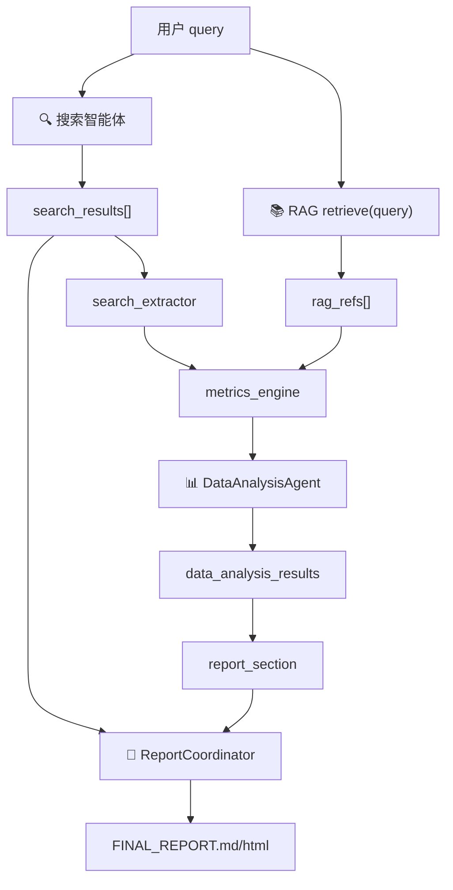

# 金融数据分析智能体 — 设计、分工与代码改动汇总

> 本文档汇总数据分析智能体从方案讨论到骨架落地的全部内容，供团队分工、联调与答辩参考。  
> 架构图见 [`项目UML图.md`](../add_AnalysisAgent.md)。

---

## 1. 背景与目标

在 XunLong 多智能体系统中，新增 **金融垂直领域的数据分析智能体**，与现有搜索、生成、审核、迭代智能体协作。

### 1.1 核心分工原则

| 智能体 | 职责 |
|--------|------|
| **搜索智能体** | 金融资讯/政策/行情网页搜索，输出 `search_results` |
| **RAG 知识库（独立小组）** | 研报/指标口径/术语/监管规则向量检索，输出 `rag_refs` |
| **数据分析智能体** | **综合分析网页搜索输出 + RAG 输出**，经**算法抽取与计算**得到 metrics/tables，生成 charts 与 key_findings |
| **生成智能体** | 基于 `data_analysis_results` 撰写金融数据报告，统一文风与结构 |
| **审核智能体** | 指标口径、数据与图表一致性、搜索与 RAG 依据交叉验证 |

**关键决策**：

- 数据分析智能体 **不负责写完整报告**；结构化分析交给数据分析智能体，文字撰写交给生成智能体。
- 数据分析智能体的 **输入是 `search_results` + RAG 检索结果**，不是用户上传的 CSV/Excel（CSV 可作为后续扩展，非主路径）。
- **数字与结论须能追溯到搜索来源或 RAG 口径**；默认走**算法路径**（正则抽取 + 指标计算），LLM 仅作可选补充（`use_llm=True`）。

### 1.2 模式特征（最终方案）

- 用户选择 **金融数据分析模式**（`financial_analysis`）
- 工作流顺序：**先网页搜索 → 再 RAG 检索 → 再数据分析**（数据分析依赖搜索产出）
- 生成智能体主要接收：
  - `data_analysis_results` → **独立「金融数据分析」章节**（metrics / tables / charts / key_findings）
  - `search_results` → 第 1–N 节正文来源（网页搜索综述，与数据分析章节分离）

### 1.3 与现有模块的区别

| 现有模块 | 实际职责 | 与数据分析智能体的关系 |
|---------|---------|----------------------|
| `search_analyzer` + `analysis_results` | 对网页结果做 **轻量** 洞察/主题归纳 | 可保留；**深度金融分析**由 `data_analyzer` 完成 |
| `DataVisualizer`（在 `ReportCoordinator` 内） | 从报告 **文字** 反推图表 | 作用于网页搜索章节；**「金融数据分析」章节**使用 `data_analysis_results.charts` |
| **新增** `DataAnalysisAgent` + `data_analysis_results` | 综合 **search_results + RAG** 做结构化金融分析 | 本次核心新增能力 |

---

## 2. 架构图（摘要）

完整 Mermaid 图见 [`add_AnalysisAgent.md`](../add_AnalysisAgent.md)（**需按本章新方案更新时序：搜索 → RAG → 分析**）。

### 2.1 数据流（文字版）

```
用户 query
        ↓
协调器识别 financial_analysis
        ↓
搜索智能体 → search_results（网页正文/摘要）
        ↓
RAG 知识库 → rag_refs（指标口径/术语/规则）
        ↓
金融数据分析智能体（输入 = search_results + rag_refs）
        → search_extractor：结构化抽取 ExtractedPoint[]
        → metrics_engine：聚合 / 同比环比 / 建表 / 结论
        → AnalysisOutput（metrics / tables / key_findings）
        → chart_builder：ECharts spec
        → data_analysis_results
        ↓
生成智能体（ReportCoordinator）
        → 第 1–N 节：网页搜索正文（LLM 撰写）
        → 「金融数据分析」节：report_section 渲染 data_analysis_results + 图表
        ↓
审核 → HTML / MD → 存储
```

---

## 3. 输出契约（schemas）

### 3.1 什么是「统一结构」

智能体之间传递的数据必须有 **固定字段、固定含义**，相当于 API 响应格式。  
用 `schemas.py` 中的 Pydantic 模型写进代码，便于生产、消费与校验。

### 3.2 字段命名约定

- **`analysis_results`**：保留给 `search_analyzer`（网页搜索轻量分析）
- **`data_analysis_results`**：新增，专用于金融数据分析智能体输出（**基于 search_results + RAG**）
- **`search_results`**：搜索智能体产出，作为数据分析智能体的 **主要输入**

### 3.3 数据结构

**`FinancialAnalyzer` 内部分析产出（`AnalysisOutput`）— 从 search_results + rag_refs 综合得出：**

```json
{
  "metrics": {"revenue_yoy": 0.23, "gross_margin": 0.41},
  "tables": [{"title": "分季度营收", "columns": [...], "rows": [...]}],
  "key_findings": [{"title": "...", "value": "...", "evidence": "..."}],
  "methodology": "算法分析路径：从 N 条搜索结果中结构化抽取 M 个数据点，经聚合与同比/环比/均值计算…",
  "search_refs": [{"title": "...", "url": "...", "snippet": "..."}],
  "rag_refs": [{"content": "...", "source": "...", "score": 0.95}]
}
```

**最终输出（`DataAnalysisResult`）— 写入 state：**

```json
{
  "status": "success",
  "source_type": "web_rag",
  "metrics": {},
  "tables": [],
  "charts": [{"type": "bar", "title": "...", "spec": {}}],
  "key_findings": [{"title": "...", "value": "...", "evidence": "..."}],
  "methodology": "分析所依据的搜索来源与 RAG 口径说明",
  "rag_refs": [{"content": "...", "source": "...", "score": 0.95}],
  "search_refs": [{"title": "...", "url": "...", "snippet": "..."}]
}
```

定义文件：`src/agents/data_analysis/schemas.py`（`DataAnalysisResult` 已含 `search_refs`、`source_type: web_rag`）

---

## 4. 接口说明

本节描述 **金融数据分析模式** 下，智能体之间经协调器 `DeepSearchState` 传递的数据形状。  
智能体不直接互调，而是：**读 state 某些字段 → 返回 envelope → 协调器写回 state**。

### 4.1 统一外壳（Agent 返回值）

几乎所有智能体 `process()` 返回同一层包装：

```python
{
    "status": "success",      # 或 "error" / "warning"
    "agent": "智能体名称",
    "result": { ... },        # 各智能体自己的 payload
    "error": "..."            # 仅失败时
}
```

协调器写入 state 时，**通常只存内层 `result`**：

```python
state["task_analysis"] = result.get("result", {})
state["analysis_results"] = result.get("result", {})
state["data_analysis_results"] = result.get("result", {})
state["synthesis_results"] = result.get("result", {})
```

### 4.2 总线：`DeepSearchState` 关键字段

金融模式下，state 中主要字段形状如下：

```python
{
    "query": "分析2024年某行业营收趋势",
    "context": {
        "output_type": "financial_analysis",
        ...
    },

    # 任务分解
    "task_analysis": { ... },

    # 搜索链（数据分析的上游输入）
    "search_results": [ ... ],          # 见 §4.5 → 传入数据分析智能体
    "analysis_results": { ... },        # 见 §4.6（轻量搜索分析，可选）

    # 数据分析链（新增）
    "data_analysis_results": { ... },   # 见 §4.4
    "data_analysis_status": "success",

    # 综合与报告
    "synthesis_results": { ... },
    "final_report": { "result": {...}, "status": "success" },
}
```

> **变更说明**：不再以 `data_sources`（CSV/Excel）作为主输入；数据分析智能体消费 `search_results`。

### 4.3 协调器 → 任务分解智能体

**传入：**

```python
{
    "query": "...",
    "context": { "output_type": "financial_analysis", ... }
}
```

**写入 `state["task_analysis"]`：**

```python
{
    "subtasks": [
        {
            "id": "s1",
            "type": "search",
            "title": "搜索行业营收与政策动态",
            "search_queries": ["..."],
            "depth_level": "deep",
            "time_context": { ... }
        }
    ],
    "strategy": "...",
    "report_type": "comprehensive"
}
```

### 4.4 协调器 → 金融数据分析智能体

**触发时机**：在 `search_results` 就绪 **之后**（不再与搜索并行）。

**传入：**

```python
{
    "query": "...",
    "search_results": [ {...}, {...} ],   # §4.5，主要分析对象
    "task_analysis": { ... },
    # RAG 在 Agent 内部通过 rag_client.retrieve(query) 获取
}
```

**写入 `state["data_analysis_results"]`（即 `DataAnalysisResult`）：**

```python
{
    "status": "success",
    "source_type": "web_rag",
    "metrics": {
        "revenue_yoy": 0.23,
        "gross_margin": 0.41
    },
    "tables": [
        {
            "title": "分季度营收（万元）",
            "columns": ["季度", "营收", "同比"],
            "rows": [["2024Q1", 12000, "18%"], ...]
        }
    ],
    "charts": [
        {
            "type": "bar",
            "title": "分季度营收（万元）",
            "spec": { /* ECharts option */ }
        }
    ],
    "key_findings": [
        {
            "title": "营收同比增长",
            "value": "23%",
            "evidence": "据搜索结果 [1] 与 RAG 毛利率口径综合判断"
        }
    ],
    "methodology": "综合 Top-5 搜索结果与金融 RAG 指标口径",
    "rag_refs": [
        {
            "content": "毛利率 = (营业收入 - 营业成本) / 营业收入...",
            "source": "金融指标口径.md",
            "score": 0.95
        }
    ],
    "search_refs": [
        {
            "title": "2024年银行业财报解读",
            "url": "https://...",
            "snippet": "..."
        }
    ],
    "message": null
}
```

**Agent 内部链路（不写入 state）：**

```
search_results ──→ search_extractor.py     → ExtractedPoint[]
rag_refs ────────→ metrics_engine.py       → metrics, tables, key_findings, methodology
                          ↓
                 financial_analyzer.py     → AnalysisOutput（编排上述两步）
                          ↓
                 build_charts()             → charts[]（chart_builder.py）
                          ↓
                 DataAnalysisAgent.process() → DataAnalysisResult（写入 state）
```

> **分析模式**：默认 `use_llm=False`（算法路径）；`use_llm=True` 或环境变量 `FINANCIAL_ANALYSIS_USE_LLM=true` 时走 LLM 综合分析，失败仍回退算法。

### 4.5 协调器 → 搜索智能体 → `search_results`

**每条 `search_results[i]` 大致为：**

```python
{
    "url": "https://...",
    "title": "文章标题",
    "snippet": "摘要...",
    "content": "正文...",
    "content_length": 5000,
    "search_query": "原始查询",
    "subtask_id": "s1",
    "source": "web",
    "rank": 1,
    "has_full_content": true
}
```

> 此列表是数据分析智能体的 **核心输入**，智能体从中抽取数字、事实与表格。

### 4.6 协调器 → 搜索分析智能体 → `analysis_results`（可选轻量层）

> 轻量归纳，**不是** `data_analysis_results` 的替代品。

**写入 `state["analysis_results"]`：**

```python
{
    "analysis_summary": "对搜索内容的总体评价...",
    "key_insights": ["洞察1", "洞察2"],
    "content_themes": ["主题A", "主题B"],
    "recommendations": ["建议1"]
}
```

数据分析智能体 **可不依赖** 此字段，直接读原始 `search_results`。

### 4.7 协调器 → 内容综合智能体

**传入：**

```python
{
    "query": "...",
    "search_results": [ {...}, {...} ],
    "analysis_results": { ... },
    "data_analysis_results": { ... },   # 已含搜索+RAG 综合分析结果
}
```

**写入 `state["synthesis_results"]`：**

```python
{
    "executive_summary": "执行摘要...",
    "main_findings": ["发现1", "发现2"],
    "report_content": "## 执行摘要\n...\n## 数据分析\n...",
    "sources": ["url1", "url2"],
    "analysis_quality": "good"
}
```

> ⚠️ **现状**：`data_analysis_results` 已传入，但 `content_synthesizer` **尚未读取该字段**。

### 4.8 协调器 → 报告协调器（生成智能体）

**传入：**

```python
generate_report(
    query="...",
    search_results=[ ... ],              # 第 1–N 节正文来源
    synthesis_results={ ... },
    data_analysis_results={ ... },       # 「金融数据分析」独立章节
)
```

**报告结构（`FINAL_REPORT.md` / `FINAL_REPORT.html`）：**

```markdown
# 报告标题
## 1. …（来自网页搜索，LLM 撰写）
## 2. …
…
## 金融数据分析          ← data_analysis_results（report_section.py 渲染）
### 核心指标 / 数据表 / 分析结论 / 引用来源
### 分析图表（HTML 中为 ECharts）
---
## 参考文献
```

实现位置：
- `report_section.py` — 将 `data_analysis_results` 转为 Markdown / HTML 章节
- `report_coordinator._assemble_report()` — 在参考文献之前插入该节
- `document_html_agent.py` — 合并 `data_analysis_charts` 渲染 ECharts

### 4.9 全流程传递关系



### 4.10 两套「分析」字段对照（勿混淆）

| state 字段 | 来源智能体 | 分析对象 | 形状关键词 |
|-----------|-----------|---------|-----------|
| `analysis_results` | `search_analyzer` | 网页文章（轻量） | `analysis_summary`, `key_insights`, `content_themes` |
| `data_analysis_results` | `data_analyzer` | **search_results + RAG** | `metrics`, `tables`, `charts`, `key_findings`, `rag_refs`, `search_refs` |

### 4.11 接口来源说明

| 类型 | 说明 |
|------|------|
| 协调器调用方式 | 沿用原项目 `process_query` + state 总线 |
| `data_analysis_results` 及 schemas | **本次新建**的自定义契约 |
| `search_results` | 原项目已有；现同时作为 **数据分析智能体输入** |
| 下游消费 | `data_analysis_results` 已进 state、持久化，并写入 **FINAL_REPORT 独立章节**；`content_synthesizer` 仍未读取 |

---

## 5. 团队分工

### 5.1 三组并行

| 小组 | 人数 | 职责 |
|------|------|------|
| **RAG 组** | 2 人 | 金融知识库、向量检索、`retrieve(query) -> List[RAGChunk]` API |
| **数据分析组** | 2 人 | 见下表 |
| **（其余）** | — | 协调器调度顺序、生成智能体消费、CLI 等 |

### 5.2 数据分析组两人分工（推荐）

| | 成员 1：金融分析核心 | 成员 2：编排 + 输出 |
|--|---------------------|------------------------|
| **负责** | 算法抽取与指标计算（`search_extractor` + `metrics_engine`） | RAG 对接、图表 spec、Agent 编排、报告章节渲染 |
| **主要文件** | `search_extractor.py`、`metrics_engine.py`、`financial_analyzer.py`、`analysis_output.py` | `data_analysis_agent.py`、`rag_client.py`、`chart_builder.py`、`report_section.py` |
| **输入** | `search_results[]` + `rag_refs[]` | 调用 `FinancialAnalyzer`，再生成 charts 并组装输出 |
| **不做** | 报告长文撰写、RAG 建库、FINAL_REPORT 组装 | 网页爬虫（搜索智能体做） |
| **Day 1 交付** | script：`mock_search.json` → `AnalysisOutput` JSON | script：mock → 完整 `data_analysis_results.json` |

**共建**：`schemas.py` + `fixtures/mock_search.json` + `fixtures/mock_rag.json`

### 5.3 RAG 的作用（在本方案中）

| 模块 | 作用 |
|------|------|
| `search_results` | 提供 **事实与数字**（行情、财报报道、政策原文） |
| `rag_refs` | 提供 **口径与定义**（指标怎么算、什么叫合理区间） |
| 数据分析智能体 | 把两者 **综合** 成结构化 `data_analysis_results` |

RAG **不替代搜索**，也不单独完成分析；必须与搜索输出一起进入数据分析智能体。

### 5.4 2 天并行策略：Mock 先行

| Mock 文件 | 模拟内容 | 谁先用 |
|-----------|---------|--------|
| `fixtures/mock_search.json` | 模拟 `search_results` | 成员 1、成员 2 |
| `fixtures/mock_rag.json` | RAG 组检索返回 | 成员 2 |

Day 2：Mock 替换为真实搜索产出 + 真实 RAG API。

---

## 6. 代码改动清单

### 6.1 目标文件结构（按新方案）

```
src/agents/data_analysis/
├── __init__.py
├── schemas.py              # 对外契约（DataAnalysisResult、SearchReference 等）
├── analysis_output.py      # 内部分析结果（AnalysisOutput，不含 charts）
├── search_extractor.py     # 从 search_results 正则结构化抽取 ExtractedPoint[]
├── metrics_engine.py         # 聚合、派生计算、建表、生成 key_findings
├── financial_analyzer.py     # 编排抽取+计算；可选 LLM；输出 AnalysisOutput
├── rag_client.py             # RAG 客户端
├── chart_builder.py            # 由 metrics/tables 生成 ECharts spec
├── report_section.py           # 将 data_analysis_results 渲染为报告章节
└── data_analysis_agent.py      # 编排：RAG → 分析 → 图表 → DataAnalysisResult

src/agents/report/
└── report_coordinator.py       # 组装 FINAL_REPORT，插入「金融数据分析」节

fixtures/
├── mock_search.json            # 模拟 search_results
├── mock_rag.json               # RAG 返回样例
└── mock_stats.json             # 算法未抽到数据时的回退样例
```

### 6.2 已完成改动

| 文件 | 状态 |
|------|------|
| `search_extractor.py` | ✅ 新建，从搜索正文正则抽取 `ExtractedPoint[]` |
| `metrics_engine.py` | ✅ 新建，算法聚合/派生计算/建表/结论 |
| `financial_analyzer.py` | ✅ 默认算法路径；可选 LLM（`use_llm` / 环境变量） |
| `data_analysis_agent.py` | ✅ 编排层：RAG → analyze → charts → 输出 |
| `chart_builder.py` | ✅ 支持分季度折线、环比柱状、指标对比柱状 |
| `report_section.py` | ✅ 将 `data_analysis_results` 渲染为报告章节 |
| `report_coordinator.py` | ✅ 在 FINAL_REPORT 插入「金融数据分析」节 + ECharts |
| `document_html_agent.py` | ✅ 合并 `data_analysis_charts` 渲染图表 |
| `coordinator.py` | ✅ 搜索完成后 `_data_analyzer_node`，传入 `search_results` |
| `schemas.py` / `analysis_output.py` | ✅ 内外契约分离，字段含注释 |

### 6.3 尚未改动（待办）

| 项 | 说明 |
|----|------|
| `content_synthesizer` | 已传 `data_analysis_results`，**仍未消费** |
| `rag_client.py` | 真实 HTTP API 待 RAG 组接入（当前 mock） |
| `search_extractor` | 抽取规则可继续扩展（多银行对比、HTML 表格解析等） |
| `metrics_engine` | 可按 metric_id 分组统计；可用 RAG 公式对两期绝对值算 YoY |
| 审核智能体 | 结论 ↔ 搜索来源 ↔ RAG 口径 一致性校验 |
| CSV/Excel 路径 | P2 可选扩展，非主方案 |
| `DataVisualizer` | 有 `data_analysis_results.charts` 时可跳过网页章节反推图表（P2） |

---

## 7. 协调器接入细节

### 7.1 如何启用金融数据分析模式

**命令行（推荐）：**

```bash
python xunlong.py analyze "分析2024年银行业营收趋势" --depth deep -v
python xunlong.py analyze "测试" --mock-search -v
```

**编程调用：**

```python
await coordinator.process_query(
    query="分析2024年银行业营收趋势",
    context={
        "output_type": "financial_analysis",
        "search_depth": "deep",
        "max_results": 20,
        "output_format": "html",
    },
)
```

> 不再需要 `data_sources`；搜索产出自动成为分析输入。

### 7.2 推荐触发顺序（新方案）

```
output_type_detector
    → task_decomposer
    → deep_searcher          # 产出 search_results
    → data_analyzer          # 输入 search_results + RAG
    → search_analyzer        # 可选，轻量分析
    → content_synthesizer
    → report_generator
```

### 7.3 State 关键字段

```python
search_results: List[Dict]             # 数据分析智能体输入（主）
data_analysis_results: Dict[str, Any]  # 数据分析智能体输出
data_analysis_status: str
# data_sources 降为可选扩展，非主路径
```

### 7.4 存储

```
storage/{project_id}/
├── intermediate/
│   ├── 02_search_results.json       # 搜索产出（分析输入）
│   ├── 03_data_analysis.json        # 数据分析智能体输出
│   ├── 04_search_analysis.json      # 轻量 search_analyzer 产出
│   └── 06_final_report.json
└── reports/
    ├── FINAL_REPORT.md              # 含「金融数据分析」独立章节
    └── FINAL_REPORT.html            # 含 ECharts 分析图表
```

---

## 8. 各模块职责

### 8.1 `search_extractor.py`

- 输入：`search_results[]`（Top-5 的 `content` / `snippet`）
- 输出：`ExtractedPoint[]`（metric_id、value、unit、period、来源序号）
- 手段：正则匹配同比增长、毛利率、季度营收、净利润等中文财报表述

### 8.2 `metrics_engine.py`

- 输入：`ExtractedPoint[]` + `rag_refs[]`
- 输出：`metrics`、`tables`、`key_findings`、`methodology`
- 计算内容：
  - **聚合**：同指标多点取最早来源
  - **派生**：营收时序区间增幅、各 `%` 点的 avg/max/min
  - **建表**：「分季度营收（万元）」含环比列、「抽取指标明细」
  - **结论**：模板化 `DataFinding`，evidence 引用来源与 RAG 口径

### 8.3 `financial_analyzer.py`

- 输入：`query`、`search_results[]`、`rag_refs[]`、可选 `use_llm` / `llm_callback`
- 输出：`AnalysisOutput`（不含 charts）
- 默认流程：`search_extractor` → `metrics_engine` → `AnalysisOutput`
- 可选：LLM 综合分析；失败或未启用时走算法；无有效数据时回退 `mock_stats.json`

### 8.4 `rag_client.py`

- 输入：`query`
- 输出：`rag_refs[]`
- 为分析提供指标口径与术语上下文（不参与正文数字抽取）

### 8.5 `data_analysis_agent.py`（编排器）

```
rag_client.retrieve(query)
search_results + rag_refs
    → FinancialAnalyzer.analyze(use_llm=False 默认)
    → build_charts(analysis)
    → DataAnalysisResult → state["data_analysis_results"]
```

### 8.6 `chart_builder.py`

- 输入：`AnalysisOutput`
- 输出：`charts[]`（ECharts spec）
- 规则：有「分季度」表 → 折线 + 环比柱；有「抽取指标明细」→ 对比柱；否则 → metrics 柱状图

### 8.7 `report_section.py` + `report_coordinator.py`

- `report_section.build_data_analysis_section()` — 将 `data_analysis_results` 转为 Markdown/HTML 章节
- `report_coordinator._assemble_report()` — 在网页搜索章节之后、参考文献之前插入 **「金融数据分析」**
- HTML 图表由 `document_html_agent` 读取 `data_analysis_charts` 初始化 ECharts

### 8.8 `analysis_output.py`

- 定义 `AnalysisOutput`：分析阶段内部契约（metrics / tables / key_findings / methodology / refs）
- 与对外 `DataAnalysisResult` 分离：后者额外含 `status`、`source_type`、`charts`

---

## 9. 命令行与 README 现状

### 9.1 当前能否用 CLI 启动？

**可以。** 使用 `analyze` 子命令：

```bash
python xunlong.py analyze "分析2024年银行业营收趋势" --depth deep -v
python xunlong.py analyze "测试" --mock-search -v   # 离线 mock 搜索
```

等价于编程调用 `context["output_type"] = "financial_analysis"`。

### 9.2 CLI 参数说明

| 参数 | 说明 |
|------|------|
| `query` | 分析主题（必填） |
| `--depth` / `-d` | 搜索深度：surface / medium / deep（默认 deep） |
| `--max-results` / `-m` | 最大搜索结果数（默认 20） |
| `--output-format` / `-o` | 报告格式 html / md（默认 html） |
| `--mock-search` | 使用 `fixtures/mock_search.json` 代替真实搜索 |
| `--verbose` / `-v` | 详细日志 |

**分析模式（编程 / 环境变量，CLI 暂无 `--use-llm`）：**

```python
# 默认：算法路径
await agent.process({"query": "...", "search_results": [...]})

# 可选：LLM 分析
await agent.process({"query": "...", "search_results": [...], "use_llm": True})
# 或环境变量 FINANCIAL_ANALYSIS_USE_LLM=true
```

### 9.3 计划中的其他形态

```bash
# 已实现见上方 analyze 子命令；以下为扩展设想
python xunlong.py analyze "..." --depth deep -o md -v
```

不再需要 `--data-file`；数据来自搜索与 RAG。

---

## 10. 方案演进记录

| 阶段 | 结论 |
|------|------|
| 初版 | 新增数据分析智能体；分析 + 图表 |
| 分工讨论 | 分析为主、生成交给生成智能体 |
| 垂直领域 | 金融场景 + RAG 知识增强 |
| 数据源 v1 | Excel/CSV + RAG（成员 1 读文件） |
| **数据源 v2（当前）** | **数据分析智能体分析 `search_results` + RAG 输出** |
| 搜索 | 先搜索，再分析（分析依赖搜索产出） |
| 代码重构 | `financial_analyzer.py` 独立承担分析 |
| **算法路径 v3** | 拆分 `search_extractor` + `metrics_engine`；默认算法、LLM 可选 |
| **报告接入 v4** | `report_section` + `ReportCoordinator` 写入 FINAL_REPORT 独立分析章节 + ECharts |
| 落地 | coordinator / Agent / CLI / 报告章节均已接入；synthesizer 消费待完善 |

---

## 11. 后续待办（按优先级）

### P0 — 能 demo

- [x] 协调器：数据分析节点移到搜索 **之后**，传入 `search_results`
- [x] 成员 1：实现 `financial_analyzer.py` + `fixtures/mock_search.json`
- [ ] RAG 组：`retrieve()` API 与 `mock_rag.json` 同结构（骨架 mock 已有）
- [x] 成员 2：`data_analysis_agent` 编排 search + RAG → 分析 → 图表
- [x] `ReportCoordinator` 消费 `data_analysis_results` 写 **FINAL_REPORT 独立章节**
- [x] 算法路径：`search_extractor` + `metrics_engine`（默认，非 LLM 抽取）

### P1 — 体验完善

- [x] `schemas.py` 增加 `search_refs`、`source_type: web_rag`
- [x] `xunlong.py` 新增 `analyze` 命令
- [x] `README_CN.md` 使用指南补充（已含 `analyze` 子命令说明）
- [ ] 审核：结论 ↔ 搜索来源 ↔ RAG 口径 一致性校验

### P2 — 扩展

- [ ] 用户上传 CSV/Excel 作为 **补充数据源**（与搜索并存）
- [ ] 有结构化 charts 时跳过 `DataVisualizer`

---

## 12. 快速验证

**CLI：**

```bash
python xunlong.py analyze "分析2024年银行业营收趋势" --mock-search -v
```

**编程调用：**

```python
import asyncio
from src.agents.data_analysis import DataAnalysisAgent
from src.llm.manager import LLMManager

MOCK_SEARCH = [...]  # fixtures/mock_search.json

async def main():
    agent = DataAnalysisAgent(LLMManager())
    out = await agent.process({
        "query": "分析2024年银行业营收趋势",
        "search_results": MOCK_SEARCH,
    })
    print(out["status"])
    print(out["result"]["key_findings"])
    print(len(out["result"]["rag_refs"]), "rag refs")

asyncio.run(main())
```

---

*文档版本：v4 — 算法分析路径（search_extractor + metrics_engine）；FINAL_REPORT 独立「金融数据分析」章节；LLM 改为可选。*
