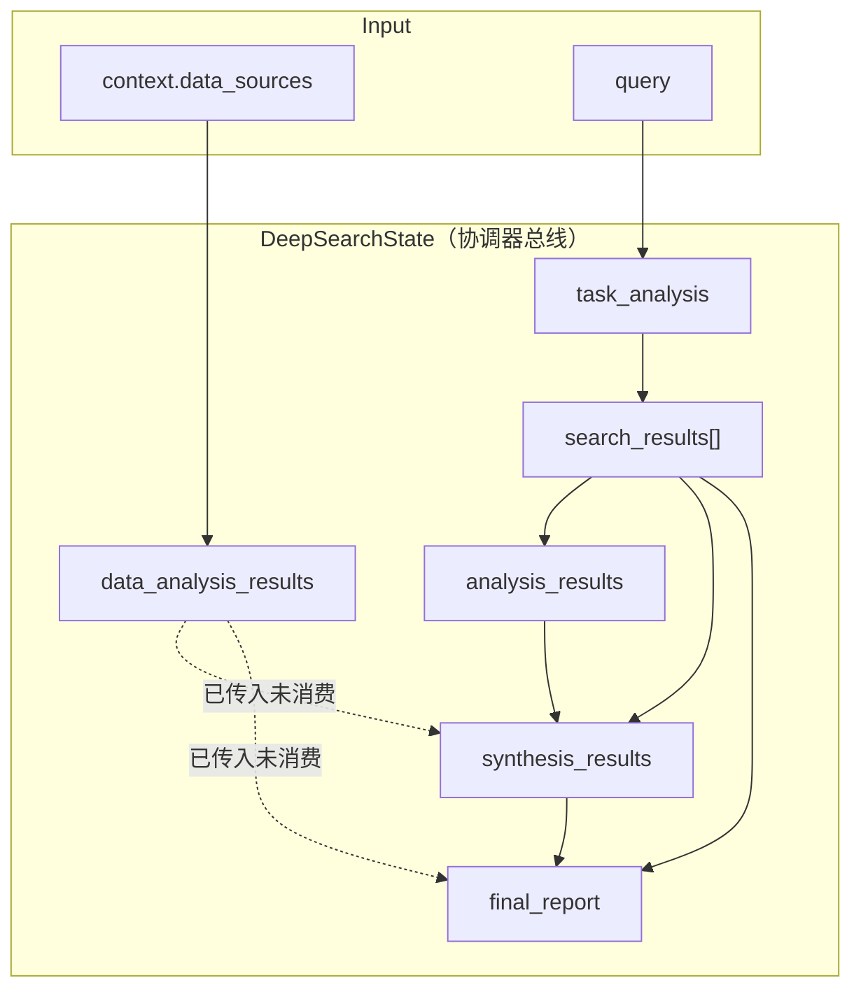

# 金融数据分析智能体 — 设计、分工与代码改动汇总

> 本文档汇总数据分析智能体从方案讨论到骨架落地的全部内容，供团队分工、联调与答辩参考。  
> 架构图见 [`项目UML图.md`](../add_AnalysisAgent.md)。

---

## 1. 背景与目标

在 XunLong 多智能体系统中，新增 **金融垂直领域的数据分析智能体**，与现有搜索、生成、审核、迭代智能体协作。

### 1.1 核心分工原则

| 智能体 | 职责 |
|--------|------|
| **数据分析智能体** | Excel/DB 读数、清洗、金融指标计算、RAG 增强解读、输出结构化结论与图表 spec |
| **生成智能体** | 撰写完整金融数据报告，融合分析结论与搜索资料，统一文风与结构 |
| **审核智能体** | 指标口径、数据与图表一致性、内外部信息交叉验证 |
| **RAG 知识库（独立小组）** | 研报/指标口径/术语/监管规则向量检索，**不做** Excel 计算 |

**关键决策**：数据分析智能体 **不负责写完整报告**；数字由代码计算，LLM 只写解读，避免与 `ReportCoordinator` / `SectionWriter` 职责重叠。

### 1.2 模式特征（最终方案）

- 用户选择 **金融数据分析模式**（`financial_analysis`）
- **保留网页搜索**：与数据分析 **并行** 执行
- 生成智能体同时接收：
  - `data_analysis_results` → 数据分析章节
  - `search_results` → 背景/市场解读章节
- RAG 由 **知识增强层** 提供，检索结果注入数据分析智能体

### 1.3 与现有模块的区别

| 现有模块 | 实际职责 | 勿混淆 |
|---------|---------|--------|
| `search_analyzer` + `state["analysis_results"]` | 分析 **网页搜索结果**（洞察、主题） | 不是 Excel/DB 分析 |
| `DataVisualizer`（在 `ReportCoordinator` 内） | 章节写完后，从 **文字** 反推图表 | 不是真实数据统计 |
| **新增** `DataAnalysisAgent` + `data_analysis_results` | 真实数据计算 + RAG 解读 + 图表 spec | 本次新增能力 |

---

## 2. 架构图（摘要）

完整 Mermaid 图见 [`add_AnalysisAgent.md`](../add_AnalysisAgent.md)，包含：

1. **核心智能体图** — 协调层 / 知识增强层（RAG）/ 执行层
2. **内容生成时序图** — 搜索 ∥ 分析 → 生成 → 审核 → 存储
3. **模式对比图** — 普通报告 vs 金融数据分析

### 2.1 数据流（文字版）

```
用户 query + data_sources（Excel/CSV/DB）
        ↓
协调器识别 financial_analysis
        ↓
┌──────────────────┬─────────────────────┐
│  搜索智能体       │  金融数据分析智能体    │
│  search_results  │  + RAG 检索          │
└────────┬─────────┴──────────┬──────────┘
         ↓                    ↓
         └────────┬───────────┘
                  ↓
         生成智能体（ReportCoordinator）
                  ↓
         审核 → HTML → 存储
```

---

## 3. 输出契约（schemas）

### 3.1 什么是「统一结构」

智能体之间传递的数据必须有 **固定字段、固定含义**，相当于 API 响应格式。  
用 `schemas.py` 中的 Pydantic 模型写进代码，便于生产、消费与校验。

### 3.2 字段命名约定

- **`analysis_results`**：保留给 `search_analyzer`（网页搜索分析）
- **`data_analysis_results`**：新增，专用于金融数据分析智能体输出

### 3.3 数据结构

**成员 1 产出（`ProcessedStats`）— 仅确定性计算：**

```json
{
  "metrics": {"revenue_yoy": 0.23, "gross_margin": 0.41},
  "tables": [{"title": "分季度营收", "columns": [...], "rows": [...]}],
  "data_summary": "共 4 个季度..."
}
```

**最终输出（`DataAnalysisResult`）— 写入 state：**

```json
{
  "status": "success",
  "source_type": "mock",
  "metrics": {},
  "tables": [],
  "charts": [{"type": "bar", "title": "...", "spec": {}}],
  "key_findings": [{"title": "...", "value": "...", "evidence": "..."}],
  "methodology": "分析口径说明",
  "rag_refs": [{"content": "...", "source": "...", "score": 0.95}]
}
```

定义文件：`src/agents/data_analysis/schemas.py`

---

## 4. 接口说明

本节描述 **金融数据分析模式** 下，智能体之间经协调器 `DeepSearchState` 传递的数据形状。  
智能体不直接互调，而是：**读 state 某些字段 → 返回 envelope → 协调器写回 state**。

### 4.1 统一外壳（Agent 返回值）

几乎所有智能体 `process()` 返回同一层包装：

```python
{
    "status": "success",      # 或 "error" / "warning"
    "agent": "智能体名称",
    "result": { ... },        # 各智能体自己的 payload
    "error": "..."            # 仅失败时
}
```

协调器写入 state 时，**通常只存内层 `result`**：

```python
state["task_analysis"] = result.get("result", {})
state["analysis_results"] = result.get("result", {})
state["data_analysis_results"] = result.get("result", {})
state["synthesis_results"] = result.get("result", {})
```

### 4.2 总线：`DeepSearchState` 关键字段

金融模式下，state 中主要字段形状如下：

```python
{
    "query": "分析2024年某公司营收趋势",
    "context": {
        "output_type": "financial_analysis",
        "data_sources": { ... },
        ...
    },

    # 任务分解
    "task_analysis": { ... },           # 见 §4.3
    "data_sources": { ... },            # 见 §4.4 输入

    # 搜索链
    "search_results": [ ... ],          # 见 §4.5
    "analysis_results": { ... },        # 见 §4.6（网页搜索分析）
    "refined_subtasks": [ ... ],

    # 数据分析链（新增）
    "data_analysis_results": { ... },   # 见 §4.7
    "data_analysis_status": "success",

    # 综合与报告
    "synthesis_results": { ... },       # 见 §4.8
    "final_report": { "result": {...}, "status": "success" },
}
```

### 4.3 协调器 → 任务分解智能体

**传入：**

```python
{
    "query": "...",
    "context": { "output_type": "financial_analysis", ... }
}
```

**写入 `state["task_analysis"]`：**

```python
{
    "subtasks": [
        {
            "id": "s1",
            "type": "search",
            "title": "...",
            "search_queries": ["..."],
            "depth_level": "deep",
            "time_context": { ... }
        }
    ],
    "strategy": "...",
    "priority": "medium",
    "estimated_time": 300,
    "time_context": { ... },
    "report_type": "comprehensive"
}
```

### 4.4 协调器 → 金融数据分析智能体

**传入：**

```python
{
    "query": "...",
    "data_sources": {
        "use_mock": True,
        "csv_path": "fixtures/sample_finance.csv",
        "excel_path": "...",
        "db_config": { ... }
    },
    "task_analysis": { ... }
}
```

**写入 `state["data_analysis_results"]`（即 `DataAnalysisResult`）：**

```python
{
    "status": "success",
    "source_type": "mock",
    "metrics": {
        "revenue_yoy": 0.23,
        "gross_margin": 0.41,
        "net_profit": 8500,
        "debt_ratio": 0.38
    },
    "tables": [
        {
            "title": "分季度营收（万元）",
            "columns": ["季度", "营收", "同比"],
            "rows": [["2024Q1", 12000, "18%"], ...]
        }
    ],
    "charts": [
        {
            "type": "bar",
            "title": "分季度营收（万元）",
            "spec": { /* ECharts option */ }
        }
    ],
    "key_findings": [
        {
            "title": "revenue_yoy",
            "value": "0.23",
            "evidence": "来自数据引擎计算结果"
        }
    ],
    "methodology": "共 4 个季度...",
    "rag_refs": [
        {
            "content": "毛利率 = (营业收入 - 营业成本) / 营业收入...",
            "source": "金融指标口径.md",
            "score": 0.95
        }
    ],
    "message": null
}
```

**Agent 内部链路（不写入 state）：**

```
data_sources → ProcessedStats { metrics, tables, data_summary }
             → charts[]
             → RAGReference[]
             → key_findings[]
             → DataAnalysisResult
```

### 4.5 协调器 → 搜索智能体 → `search_results`

**每条 `search_results[i]` 大致为：**

```python
{
    "url": "https://...",
    "title": "文章标题",
    "snippet": "摘要...",
    "content": "正文...",
    "content_length": 5000,
    "search_query": "原始查询",
    "subtask_id": "s1",
    "subtask_title": "...",
    "extraction_time": "2024-...",
    "source": "web",              # 或 "user_document"
    "rank": 1,
    "has_full_content": true
}
```

形状为 **list[dict]**，字段随爬虫结果略有差异，无固定 Pydantic schema。

### 4.6 协调器 → 搜索分析智能体 → `analysis_results`

> ⚠️ 这是 **网页搜索** 的分析结果，与 `data_analysis_results` 不是同一回事。

**写入 `state["analysis_results"]`：**

```python
{
    "analysis_summary": "对搜索内容的总体评价...",
    "key_insights": ["洞察1", "洞察2"],
    "relevance_scores": [8, 7, 9],
    "content_themes": ["主题A", "主题B"],
    "recommendations": ["建议1"]
}
```

### 4.7 协调器 → 内容综合智能体

**传入：**

```python
{
    "query": "...",
    "search_results": [ {...}, {...} ],      # §4.5
    "analysis_results": { ... },              # §4.6（已是内层 result）
    "data_analysis_results": { ... },         # §4.4（已是内层 result）
}
```

**写入 `state["synthesis_results"]`：**

```python
{
    "executive_summary": "执行摘要...",
    "main_findings": ["发现1", "发现2"],
    "report_content": "## 执行摘要\n...\n## 详细分析\n...",
    "detailed_analysis": "Markdown 正文...",
    "conclusions": ["结论1"],
    "sources": ["url1", "url2"],
    "query": "...",
    "synthesis_timestamp": "2024-...",
    "sources_count": 5,
    "analysis_quality": "good"
}
```

> ⚠️ **现状**：`data_analysis_results` 已传入，但 `content_synthesizer` **尚未读取该字段**。

### 4.8 协调器 → 报告协调器（生成智能体）

**传入：**

```python
generate_report(
    query="...",
    search_results=[ ... ],              # §4.5
    synthesis_results={ ... },           # §4.7
    report_type="comprehensive",
    output_format="html",
    refined_subtasks=[ ... ],
    data_analysis_results={ ... },       # §4.4（骨架阶段仅打日志）
)
```

**写入 `state["final_report"]`：**

```python
{
    "status": "success",
    "result": {
        "report": {
            "content": "Markdown 全文...",
            "html_content": "<html>...",
            "word_count": 3500,
            "metadata": { "average_confidence": 0.85, ... },
            "sections": [ ... ]
        },
        "status": "success"
    }
}
```

### 4.9 全流程传递关系



### 4.10 两套「分析」字段对照（勿混淆）

| state 字段 | 来源智能体 | 分析对象 | 形状关键词 |
|-----------|-----------|---------|-----------|
| `analysis_results` | `search_analyzer` | 网页文章 | `analysis_summary`, `key_insights`, `content_themes` |
| `data_analysis_results` | `data_analyzer` | Excel/DB 数据 | `metrics`, `tables`, `charts`, `key_findings`, `rag_refs` |

两者字段名相似（都有 `key_insights`），但 **含义完全不同**，传递时各走各的字段，不要合并。

### 4.11 接口来源说明

| 类型 | 说明 |
|------|------|
| 协调器调用方式 | 沿用原项目 `process_query` + state 总线 |
| `data_analysis_results` 及 schemas | **本次新建**的自定义契约 |
| `search_results`、`analysis_results`、`synthesis_results` | 原项目已有形状 |
| 下游消费缺口 | `data_analysis_results` 已进 state 并持久化，synthesizer / report **尚未真正消费** |

---

## 5. 团队分工

### 5.1 四组并行

| 小组 | 人数 | 职责 |
|------|------|------|
| **RAG 组** | 2 人 | 金融知识库、向量检索、`retrieve(query) -> List[RAGChunk]` API |
| **数据分析组** | 2 人 | 见下表 |
| **（其余）** | — | 生成/协调器消费、CLI、README 等按需 |

### 5.2 数据分析组两人分工（推荐）

| | 成员 1：输入数据 + 处理 | 成员 2：解读 + 可视化 + 输出 |
|--|------------------------|------------------------------|
| **负责** | 读 Excel/CSV/DB、清洗、金融指标计算、汇总表 | RAG 对接、LLM 解读、图表 spec、Agent 主流程、协调器挂钩 |
| **主要文件** | `data_engine.py`、`excel_reader.py` | `data_analysis_agent.py`、`rag_client.py`、`chart_builder.py` |
| **不做** | LLM、RAG、协调器 | 复杂 SQL、向量库 |
| **Day 1 交付** | script：xlsx → metrics JSON | script：mock → 完整 `data_analysis_results.json` |

**共建**：`schemas.py` + `fixtures/mock_*.json`（第 1 小时四人一起定，之后不改字段名）

### 5.3 难度参考

- **成员 2 略难**（集成面广、要对 demo 负责），但可用 Mock  Day 1 独立推进
- **成员 1 难在「准」**（指标口径、脏数据）

### 5.4 2 天并行策略：Mock 先行

**Mock** = 开发阶段用的假数据/假接口，让下游不用等上游完工。

| Mock 文件 | 模拟内容 | 谁先用 |
|-----------|---------|--------|
| `fixtures/mock_stats.json` | 成员 1 的最终产出 | 成员 2 |
| `fixtures/mock_rag.json` | RAG 组检索返回 | 成员 2 |

Day 2 上午：把 Mock **替换** 为真实 `analyze()` 和真实 RAG API（通常只改少量 import/配置）。

环境变量：

- `DATA_ANALYSIS_RAG_MOCK=false` — 关闭 RAG Mock
- `FINANCIAL_RAG_API_URL` — RAG 组真实 API 地址

---

## 6. 代码改动清单

### 6.1 新增文件

```
src/agents/data_analysis/
├── __init__.py
├── schemas.py              # 输出契约（Pydantic）
├── data_engine.py          # 成员 1：数据引擎（默认 Mock）
├── rag_client.py           # RAG 客户端（默认 Mock）
├── chart_builder.py        # 成员 2：ECharts spec
└── data_analysis_agent.py  # 主智能体

fixtures/
├── mock_stats.json         # 成员 1 目标产出样例
├── mock_rag.json           # RAG 组目标返回样例
└── sample_finance.csv      # 测试 CSV

src/tools/excel_reader.py   # 成员 1 待实现（pandas）

prompts/agents/data_analyzer/system.yaml  # LLM 解读 prompt（骨架）
```

### 6.2 修改文件

| 文件 | 改动摘要 |
|------|----------|
| `src/agents/coordinator.py` | 注册 `DataAnalysisAgent`；State 增加 `data_sources`、`data_analysis_results`、`data_analysis_status`；新增 `_is_financial_analysis_mode`、`_data_analyzer_node`；金融模式下在搜索前触发分析；LangGraph 路由增加 `financial_analysis`；向 synthesizer / report 传递分析结果 |
| `src/storage/search_storage.py` | 新增 `save_data_analysis()` → `intermediate/03_data_analysis.json` |
| `src/agents/report/report_coordinator.py` | `generate_report()` 增加参数 `data_analysis_results`（骨架阶段仅日志，章节生成待完善） |
| `requirements.txt` | 增加 `pandas>=2.0.0`、`openpyxl>=3.1.0` |

### 6.3 尚未改动（待办）

| 项 | 说明 |
|----|------|
| `xunlong.py` CLI | **尚无** `analyze` 子命令，不能像在 README 里那样 `python xunlong.py report ...` 直接启动 |
| `README_CN.md` | 使用指南未增加金融数据分析章节 |
| `output_type_detector.py` | 未增加关键词自动识别（目前靠 context 显式指定） |
| `content_synthesizer.py` | 已传 `data_analysis_results`，但未专门消费 |
| `ReportCoordinator` / `SectionWriter` | 未根据分析结果写独立数据章节 |
| 搜索与分析 **真并行** | 骨架为搜索前顺序 `await`，可改为 `asyncio.gather` |

---

## 7. 协调器接入细节

### 7.1 如何启用金融数据分析模式

通过 `context` 显式指定（编程或 API）：

```python
await coordinator.process_query(
    query="分析2024年某公司营收趋势",
    context={
        "output_type": "financial_analysis",  # 或 "mode": "financial_analysis"
        "data_sources": {
            "use_mock": True,   # 骨架默认；成员 1 完成后改为 False
            # "csv_path": "fixtures/sample_finance.csv",
            # "excel_path": "path/to/file.xlsx",
        },
        "search_depth": "deep",
        "max_results": 20,
        "output_format": "html",
    },
)
```

### 7.2 State 新增字段

```python
data_sources: Dict[str, Any]           # excel_path / csv_path / db_config / use_mock
data_analysis_results: Dict[str, Any]  # DataAnalysisResult.model_dump()
data_analysis_status: str              # success | error | skipped | pending
```

### 7.3 工作流触发点

- `_deep_searcher_node` 开头：若 `_is_financial_analysis_mode(state)`，则调用 `_data_analyzer_node`
- 分析结果经 `_content_synthesizer_node`、`_report_generator_node` 传给下游
- 项目结束时 `_save_search_results` 调用 `storage.save_data_analysis()`

### 7.4 存储目录结构（增量）

```
storage/{project_id}/
├── intermediate/
│   ├── 03_data_analysis.json    # 新增：金融数据分析结果
│   ├── 04_search_analysis.json  # 原有：网页搜索分析
│   └── ...
├── search_results/
└── reports/
```

---

## 8. 各模块职责（骨架阶段行为）

### 8.1 `data_engine.py`（成员 1）

- `use_mock=True`（默认）→ 读取 `fixtures/mock_stats.json`
- `use_mock=False` + 文件路径 → 调用 `_analyze_from_file`（**TODO：接入 pandas**）

### 8.2 `rag_client.py`（成员 2 / RAG 组）

- 默认读 `fixtures/mock_rag.json`
- `DATA_ANALYSIS_RAG_MOCK=false` + `FINANCIAL_RAG_API_URL` → 接真实 HTTP API（**TODO**）

### 8.3 `data_analysis_agent.py`（成员 2）

流程：`analyze()` → `rag_client.retrieve()` → `build_charts()` → LLM `_interpret()`（失败则占位 findings）→ `DataAnalysisResult`

### 8.4 `chart_builder.py`

- 优先从 `tables` 找「分季度」类表格生成柱状图
- 否则用 `metrics` 生成概览图
- 复用 `src/agents/html/echarts_generator.py`

---

## 9. 命令行与 README 现状

### 9.1 当前能否用 CLI 启动？

**不能。** 现有 CLI 仅有：

```bash
python xunlong.py report "..."
python xunlong.py fiction "..."
python xunlong.py ppt "..."
```

`report` 命令固定 `output_type: 'report'`，不会进入金融数据分析模式。

### 9.2 计划中的 CLI 形态（未实现）

```bash
python xunlong.py analyze "分析2024年某公司营收趋势"

python xunlong.py analyze "分析营收与利润趋势" \
  --data-file fixtures/sample_finance.csv \
  --no-mock \
  -v
```

---

## 10. 方案演进记录（讨论摘要）

| 阶段 | 结论 |
|------|------|
| 初版 | 新增数据分析智能体，与迭代智能体并列；分析 + 图表 |
| 分工讨论 | **分析为主、生成交给生成智能体**；LLM 不算数，只写解读 |
| 垂直领域 | 金融场景 + RAG 知识增强 |
| 搜索 | 曾考虑分析模式跳过搜索 → **最终保留** 网页搜索并行 |
| 落地 | 创建 `data_analysis/` 骨架 + coordinator 挂钩 |
| 2 天交付 | Mock 先行、契约先行、成员 1/2 分轨并行 |
| CLI | 骨架未接 CLI，需后续补 `analyze` 命令 |

---

## 11. 后续待办（按优先级）

### P0 — 能 demo

- [ ] 成员 1：`data_engine.py` 真实读取 `sample_finance.csv`，计算 3–5 个指标
- [ ] RAG 组：`retrieve()` API 与 `mock_rag.json` 同结构
- [ ] 成员 2：RAG client 接真实 API
- [ ] `xunlong.py` 新增 `analyze` 命令
- [ ] `ReportCoordinator` / `SectionWriter` 消费 `data_analysis_results` 写数据章节

### P1 — 体验完善

- [ ] 搜索与分析 `asyncio.gather` 真并行
- [ ] `output_type_detector` 金融关键词识别
- [ ] `README_CN.md` 使用指南补充
- [ ] 迭代流程：数据变更时重跑分析

### P2 — 扩展

- [ ] SQLite / 金融 DB 查询
- [ ] 审核智能体校验「结论 ↔ 图表 ↔ 搜索资料」
- [ ] 有结构化 charts 时跳过 `DataVisualizer` 重复出图

---

## 12. 快速验证（开发自测）

安装依赖后，可在 Python 中单独测智能体（Mock 模式不依赖 LLM 也可产出 metrics/charts）：

```python
import asyncio
from src.agents.data_analysis import DataAnalysisAgent
from src.llm.manager import LLMManager

async def main():
    agent = DataAnalysisAgent(LLMManager())
    out = await agent.process({
        "query": "分析2024年营收趋势",
        "data_sources": {"use_mock": True},
    })
    print(out["status"])
    print(out["result"]["metrics"])
    print(len(out["result"]["charts"]), "charts")

asyncio.run(main())
```

协调器全链路需配置 LLM API 与环境，并传入 `output_type: "financial_analysis"`。

---

*文档版本：与骨架代码同步，最后更新于数据分析智能体模块初版落地。*
