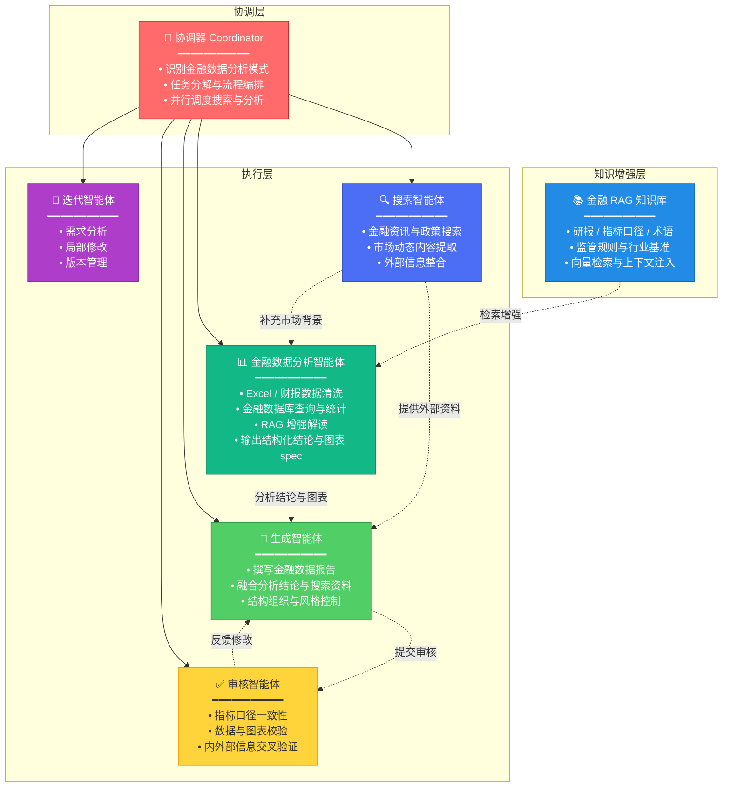
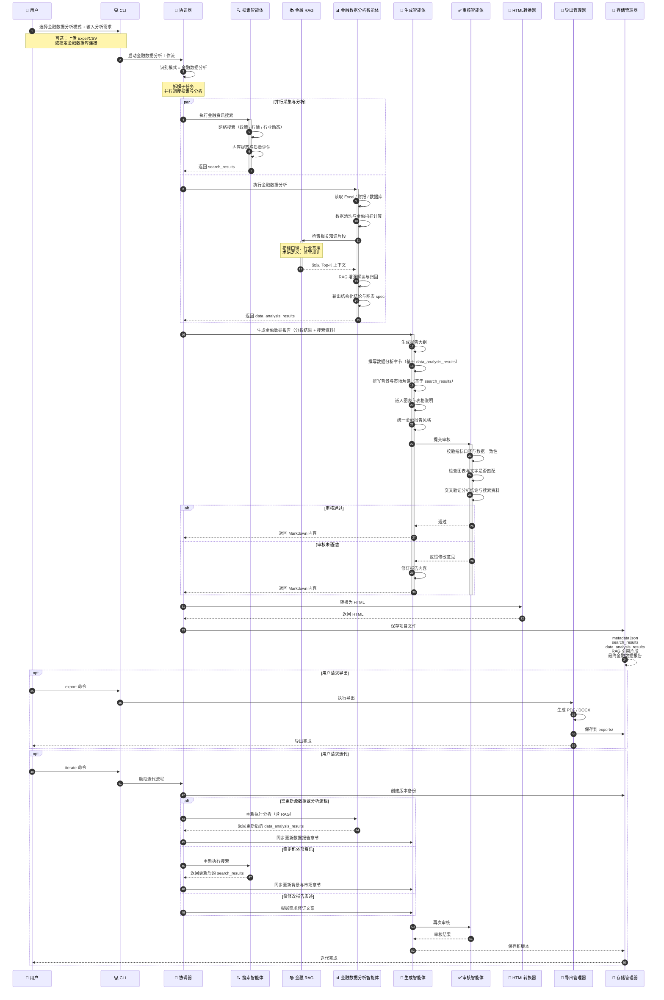
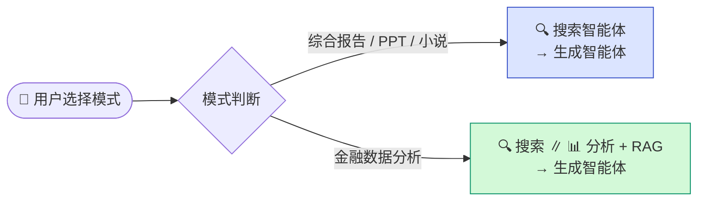

### 核心智能体（金融数据分析模式）

> **模式说明**：用户选择「金融数据分析模式」时，网页搜索与数据分析并行执行；数据分析智能体结合 RAG 金融知识库完成指标计算与解读，生成智能体综合 **分析结果 + 搜索资料** 撰写报告。

### 金融数据分析内容生成流程

> 网页搜索与数据分析 **并行执行**；生成智能体同时接收 `data_analysis_results` 与 `search_results`，分别用于数据章节与背景/市场解读章节。

### 模式对比（路由说明）

