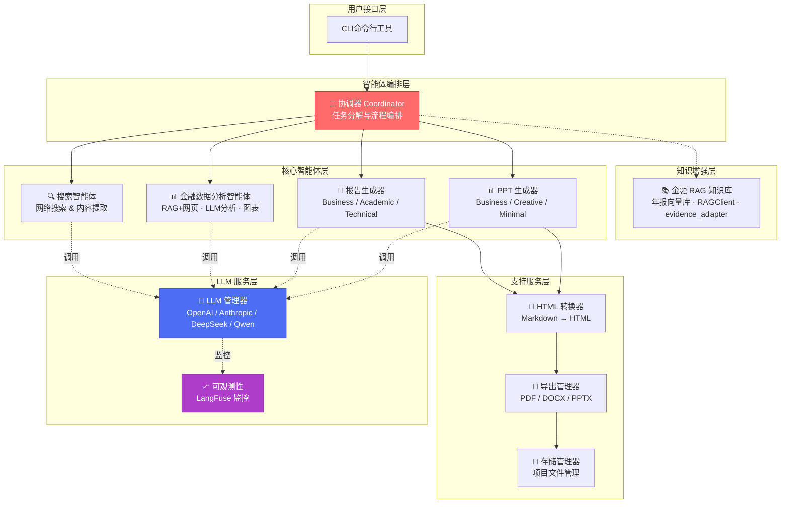
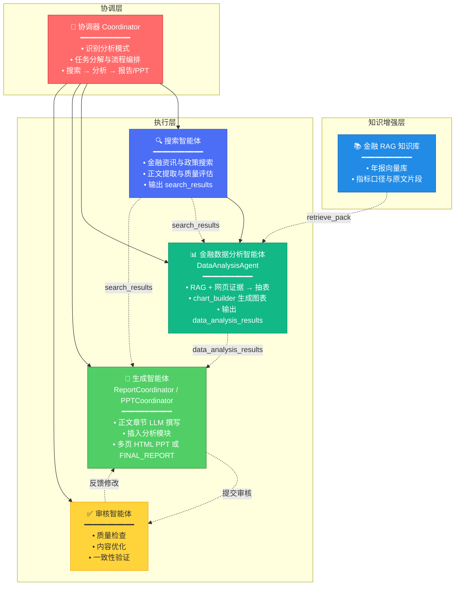
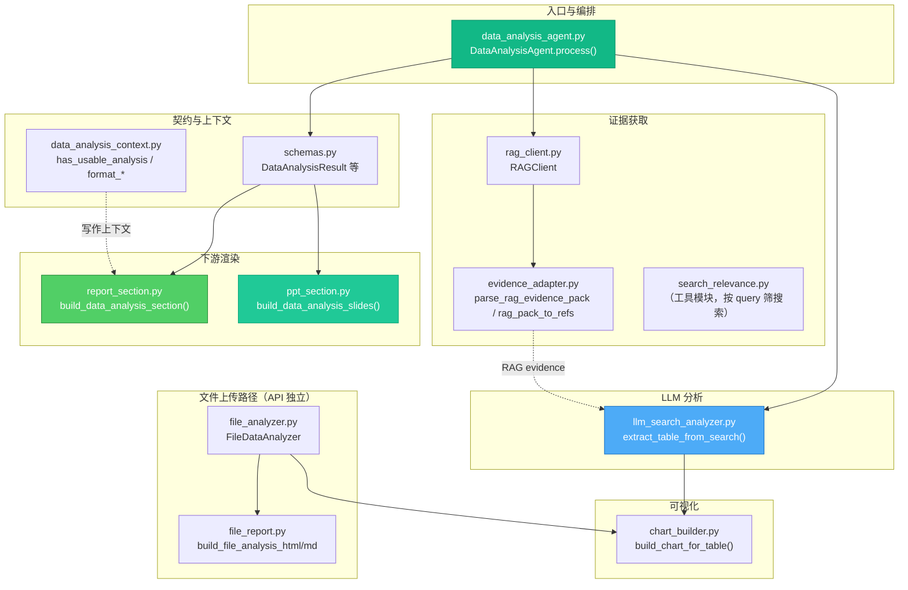
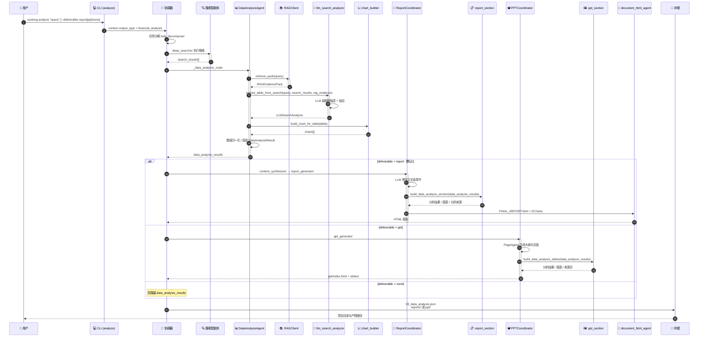
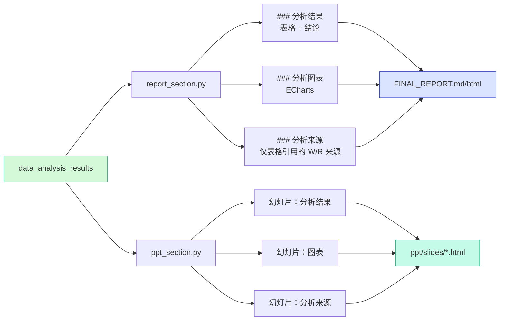
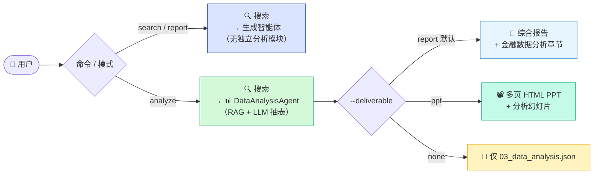
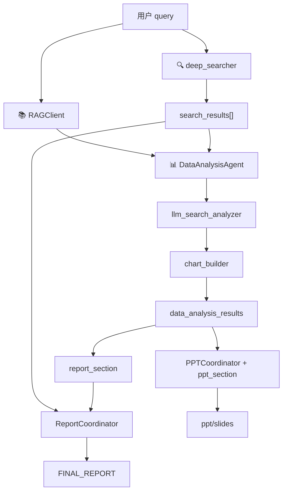

### 架构组件图

### 核心智能体（金融数据分析模式）

> **模式说明**：用户通过 `xunlong analyze` 进入金融数据分析模式。协调器**先完成网页搜索**，再调用金融数据分析智能体；智能体内部检索 **RAG 年报证据**，与 `search_results` 一并交给 **LLM 抽取数值表**，生成结构化 `data_analysis_results`，最后按 `--deliverable` 产出报告 / PPT / 仅分析 JSON。

### 多智能体协作流程

采用基于LangGraph的状态机工作流：

```mermaid
graph LR
    A[👤 用户输入] --> B[🔍 需求分析]
    B --> C[📋 任务分解]
    C --> D[🌐 并行搜索]
    D --> E[📦 内容整合]
    E --> F[✨ 智能生成]
    F --> G[✅ 质量审核]
    G --> H[🔄 格式转换]
    H --> I[📤 导出输出]

    style A fill:#e3f2fd,stroke:#1976d2
    style B fill:#f3e5f5,stroke:#7b1fa2
    style C fill:#f3e5f5,stroke:#7b1fa2
    style D fill:#fff3e0,stroke:#f57c00
    style E fill:#fff3e0,stroke:#f57c00
    style F fill:#e8f5e9,stroke:#388e3c
    style G fill:#e8f5e9,stroke:#388e3c
    style H fill:#fce4ec,stroke:#c2185b
    style I fill:#fce4ec,stroke:#c2185b
```

---

### `data_analysis/` 模块内部结构

> 目录路径：`src/agents/data_analysis/`（共 13 个文件）

| 文件 | 作用 |
|------|------|
| `data_analysis_agent.py` | 智能体入口：RAG 检索 → LLM 抽表 → 图表 → 组装 `DataAnalysisResult` |
| `llm_search_analyzer.py` | 将网页 + RAG 证据交 LLM，抽取数值表、结论、methodology |
| `rag_client.py` | RAG 检索客户端（Chroma 年报库 / mock / 远程 API） |
| `evidence_adapter.py` | 统一解析 search / RAG evidence pack，转换为引用结构 |
| `search_relevance.py` | 按 query 筛选相关搜索结果（独立工具，可选） |
| `chart_builder.py` | 由数据表生成 ECharts spec |
| `schemas.py` | Pydantic 数据契约（`DataAnalysisResult` 等） |
| `data_analysis_context.py` | 报告写作上下文、章节整合标记 |
| `report_section.py` | 渲染 FINAL_REPORT 独立章节「金融数据分析」 |
| `ppt_section.py` | 渲染 PPT 分析幻灯片（结论页前插入） |
| `file_analyzer.py` | 用户上传 CSV/文本的独立分析路径 |
| `file_report.py` | 文件分析结果的 HTML/Markdown 渲染 |
| `__init__.py` | 模块对外导出 |

---

### 金融数据分析内容生成流程

> **顺序执行**：先搜索 → 再分析（含 RAG）；分析模块与正文分离渲染。`--deliverable` 控制最终产出物。

---

### 分析模块在报告 / PPT 中的呈现

---

### 模式对比（路由说明）

---

### 数据流总览

---

*文档版本：v2 — 对齐 LLM 抽表主路径；RAG 内嵌于 DataAnalysisAgent；支持 `--deliverable report/ppt/none`。*
